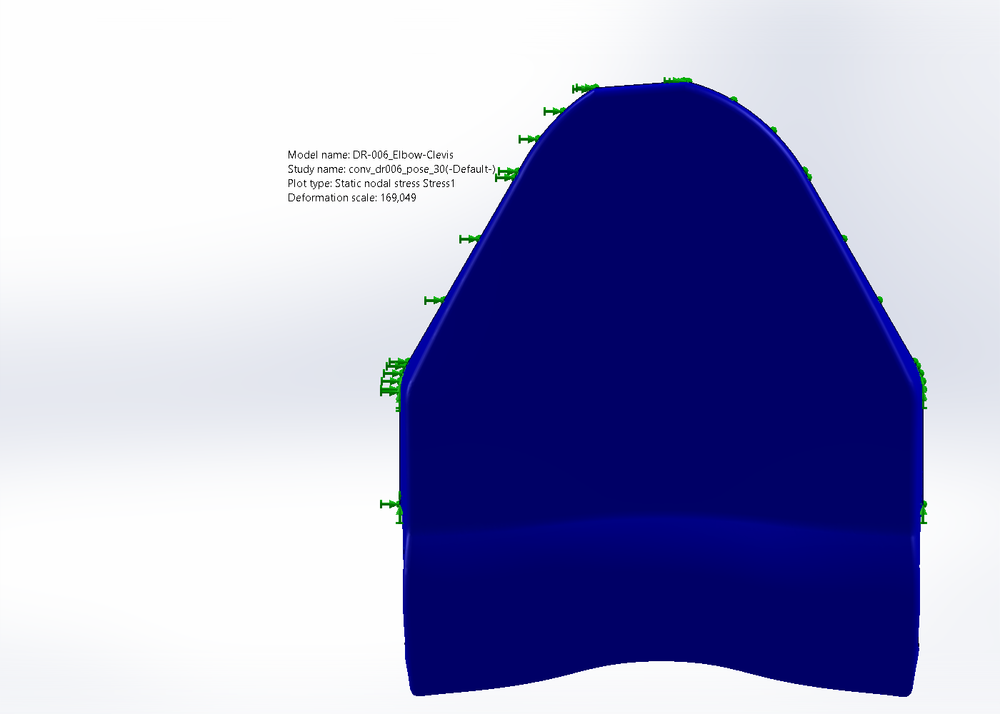
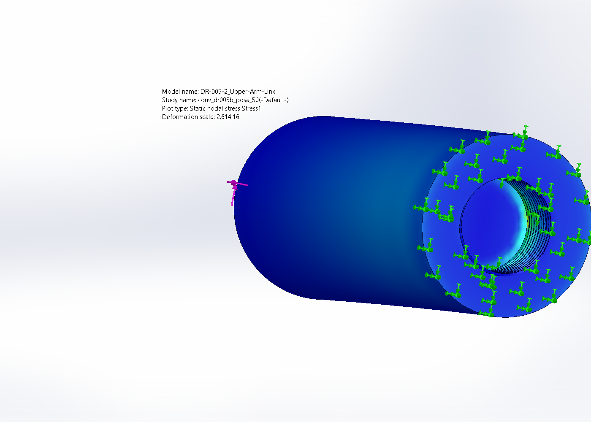
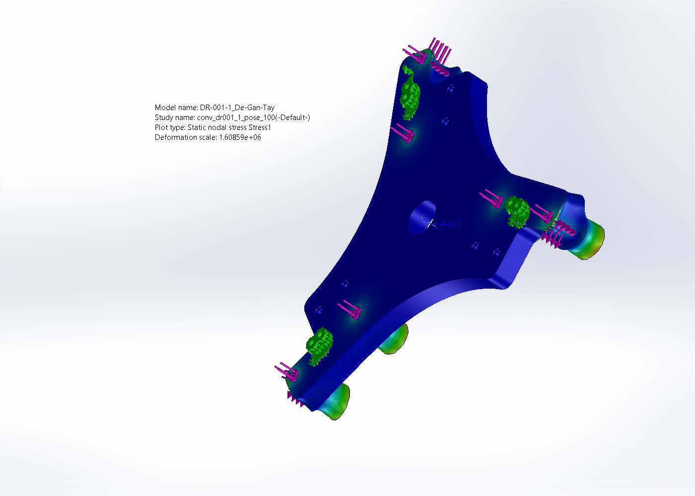

# MÔ PHỎNG BỀN ROBOT Ở NHIỀU TƯ THẾ KHÓ (multi-pose FEA)

**Ngày:** 2026-07-19 · **Phần mềm:** SolidWorks Simulation 2023 SP3 (tĩnh tuyến tính) + MATLAB R2025a (tải)
**Tải:** payload 2 kg, gia tốc TCP đỉnh ~1,18 g · **Vật liệu:** toàn bộ nhôm 6061-T6 (σ_chảy 275 MPa)

---

## 1. Vì sao phải mô phỏng nhiều tư thế

FEA cơ sở (`KETQUA_BEN.md`) đặt tải tại **một tư thế đại diện** trên quỹ đạo pick-and-place. Nhưng
robot Delta làm việc trên **cả vùng làm việc** Ø800×250 mm; tải lên từng khâu **thay đổi theo tư thế**:

- **Lực đầu công tác** F_ee = m_ee·(a−g) — độ lớn hầu như KHÔNG đổi theo tư thế (chỉ phụ thuộc gia tốc
  đỉnh), nên tải bàn máy DR-007 gần như cố định.
- **Lực dọc mỗi cặp thanh truyền** f_i và **mô men uốn bắp tay** — **phụ thuộc mạnh vào tư thế**: ở
  **biên vùng làm việc** góc truyền (transmission angle) xấu đi, ma trận hình học [l₁ l₂ l₃] gần suy
  biến hơn → một cặp thanh truyền phải gánh lực lớn hơn nhiều so với ở tâm.

Vì vậy cần quét toàn vùng làm việc, tìm **tư thế khó nhất** (worst-case) và mô phỏng bền ở đó.

## 2. Phân tích tải theo tư thế (MATLAB `ForceAnalysis/force_poses.m`)

**Phương pháp:** với mỗi tư thế, giải động học nghịch lấy góc khớp → dựng ma trận hướng thanh truyền
[l₁ l₂ l₃]; **quét 26 hướng gia tốc đỉnh** (|a| = 1,18 g) và lấy **worst-case**:
lực cặp thanh truyền f_i = [l₁ l₂ l₃]⁻¹·F_ee, lực TCP |F_ee|, mô men khớp τ = Jᵥᵀ·F_ee.

**Tập tư thế khảo sát:** tâm vùng làm việc + **24 điểm biên** (R = 400 mm, 12 phương vị, ở mặt trên
z = −800 và mặt dưới z = −1050 của trụ) + 4 waypoint quỹ đạo P&P. Bằng chứng: `out/pose_log.txt`,
`out/pose_results.mat`, hình `figs/pose_fmax_workspace.png`.

### Kết quả then chốt

| Đại lượng | Tại tâm | **Worst-case (biên)** | Tư thế worst | So baseline P&P |
|---|---|---|---|---|
| f_max — lực 1 cặp thanh truyền | 139,2 N | **182,4 N** | biên R400, az270°, z−1050 | 122,7 N → **×1,49** |
| \|F_ee\| — lực bàn máy | 176,1 N | 176,1 N | (mọi tư thế) | 175,8 N → ×1,00 |
| τ — mô men khớp (thành phần bàn máy) | ~35 N·m | **74,3 N·m** | biên R400, az270°, z−1050 | — |
| M_uốn bắp tay = f_max·L1 | 56,7 N·m | **74,3 N·m** | (như trên) | ~50 N·m → ×1,49 |
| Số điều kiện Jacobian (cond) | 1,83 | 2,75 | biên z−1050 | (vùng sạch, không kỳ dị) |

**Nhận xét:** tư thế khó nhất nằm ở **mép dưới vùng làm việc** (R = 400 mm, z = −1050 mm) — nơi cánh
tay vươn xa nhất và thấp nhất, góc truyền xấu nhất (cond 2,75). Ở đó lực cặp thanh truyền và mô men
uốn bắp tay tăng **×1,49** so với tư thế cơ sở. Lực bàn máy không đổi. Không có tư thế nào rơi vào
kỳ dị (cond max 2,75, còn xa ngưỡng).

## 3. Mô phỏng bền tại tải worst-case (FEA)

Chạy lại FEA các khâu **nhạy với tư thế** ở tải worst-case (mục 2), giữ nguyên điều kiện biên như FEA
cơ sở, chỉ nâng độ lớn tải:

| Chi tiết | Tải worst-case | σ von Mises đỉnh (MPa) | **FOS worst-pose** | FOS baseline |
|---|---|---|---|---|
| DR-006 Elbow-Clevis | 182,4 N (×1,49) | 36,3 / 33,7 / 38,8 | **7,1** | 10,5 |
| DR-005-2 Upper-Arm-Link | 275 N ⇒ 74,3 N·m (×1,49) | 6,32 / 4,01 / 5,47 | **43,5** | 64,7 |
| DR-001-1 Tấm đế | 894 N (×1,49) | 0,217 / 0,186 / 0,191 | **1268** | 1890 |
| DR-007 Moving-Platform | 176 N (×1,00, không đổi) | 18,71 | **14,7** | 14,7 |
| DR-001-3 Mặt treo | trọng lượng robot (không đổi theo tư thế) | 3,84 | **71,5** | 71,5 |

σ đỉnh cho 3 kích thước lưới (thô→mịn). FEA tuyến tính nên σ tỉ lệ tải: DR-006 26,1→38,8 MPa đúng ×1,49.
Bảng hội tụ: `out/conv_*_pose.csv`.

> **Ghi chú chuyển vị:** DR-005-2 URES đỉnh (~11,5 mm) là **spike một nút số** ở mép ngàm (không nhất
> quán với ứng suất 6 MPa), như đã ghi ở FEA cơ sở — ưu tiên σ/FOS. Các khâu còn lại chuyển vị < 0,1 mm.

## 4. Kết luận

- **Tư thế khó nhất = mép dưới vùng làm việc** (R = 400 mm, z = −1050 mm): cánh tay vươn xa + thấp nhất,
  góc truyền xấu nhất → lực cặp thanh truyền và mô men uốn bắp tay tăng **×1,49** so với tư thế cơ sở.
- **Ở tải worst-case này, FOS nhỏ nhất toàn robot = 7,1** (khớp khuỷu DR-006) — vẫn **an toàn dư bền ≥ 7
  lần**. Mọi khâu khác FOS ≥ 14 (bàn máy), 43 (bắp tay), 71 (mặt treo), 1268 (tấm đế).
- **Kết luận: robot đủ bền trên TOÀN vùng làm việc**, kể cả các tư thế khó nhất ở biên, với payload 2 kg
  và gia tốc đỉnh 1,18 g. Không có tư thế nào rơi vào kỳ dị (cond Jacobian max 2,75). Việc đổi toàn bộ
  kết cấu (kể cả đế) sang nhôm 6061-T6 vẫn giữ hệ số an toàn ≥ 7 ở mọi tư thế.

## 5. Tệp bằng chứng

- Tải theo tư thế (MATLAB): `ForceAnalysis/force_poses.m`, `out/pose_log.txt`, `out/pose_results.mat`,
  `figs/pose_fmax_workspace.png` (bản đồ lực cặp thanh truyền trên vùng làm việc).
- FEA worst-pose (SolidWorks): `FEA_Simulation/run_parts_pose.ps1`, `out/conv_{dr006,dr005b,dr001_1}_pose.csv`,
  `figs/fea_*_pose_vonMises.png`.
- FEA cơ sở (1 tư thế): `KETQUA_BEN.md`.
