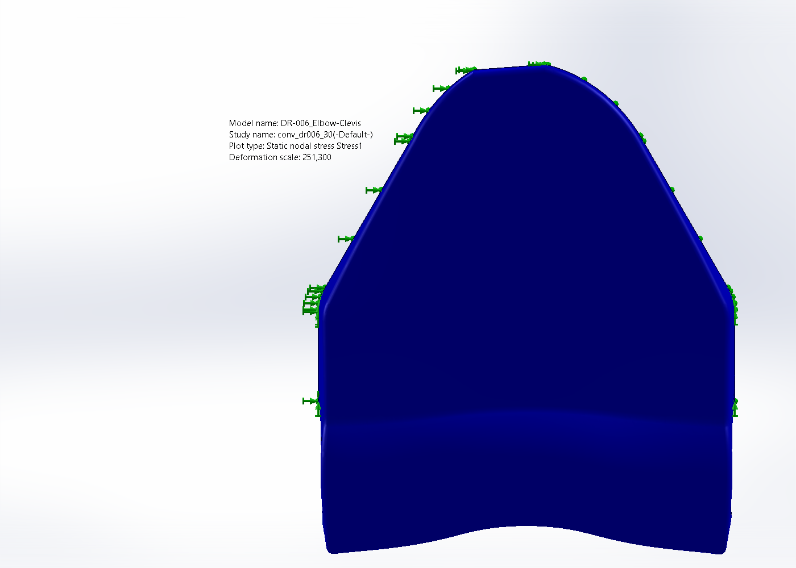
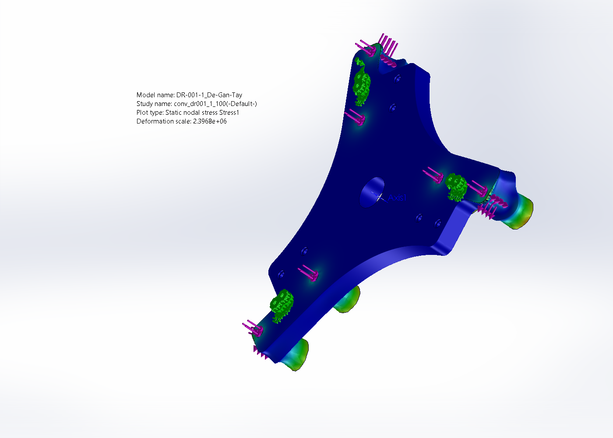
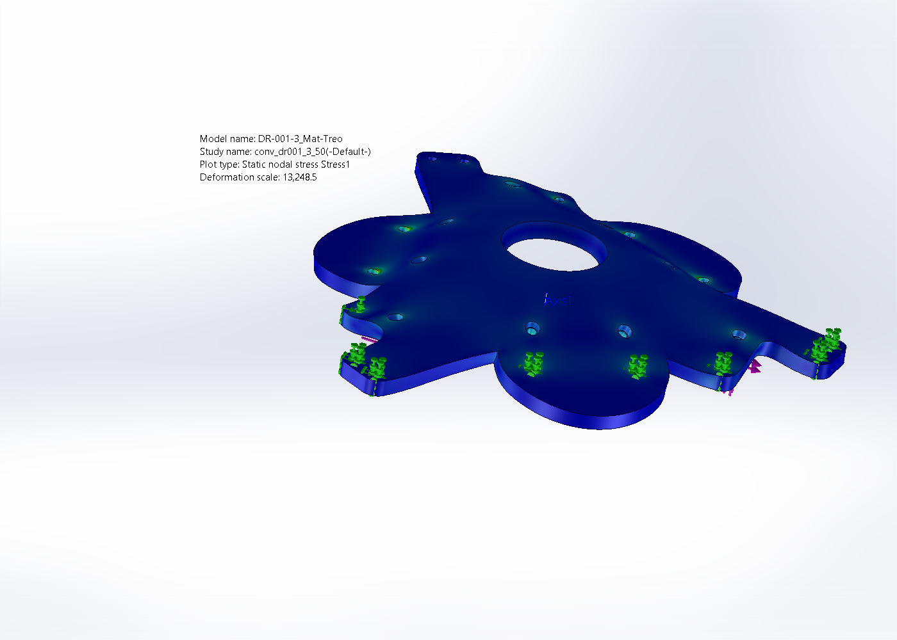

# THUYẾT MINH CHI TIẾT — MÔ PHỎNG BỀN (FEA) DELTA ROBOT

> Tài liệu này giải thích **toàn bộ** quá trình mô phỏng bền của robot delta: từ cơ sở lý thuyết
> phương pháp phần tử hữu hạn (FEA), ý nghĩa từng thông số, cách đặt điều kiện biên và tải, cách
> đọc hình kết quả, cách tính độ võng bằng giải tích để đối chiếu, cho tới nguyên nhân của các kết
> quả bất thường và giải pháp. Mục tiêu: người đọc hiểu rõ *vì sao làm như vậy* và *con số nghĩa là gì*.
>
> **Phần mềm:** SolidWorks Simulation 2023 SP3 · **Loại bài toán:** phân tích tĩnh tuyến tính
> (linear static) · **Ngày:** 2026-07-13, **cập nhật 2026-07-18** (đế đổi sang **nhôm 6061-T6**, tách
> 3 khối, probe lại mặt, chạy lại FEA 5 chi tiết) · **Tải:** payload 2 kg (tải đỉnh động từ `ForceAnalysis/`).
>
> **Cập nhật vật liệu đế (2026-07-18):** trước đây đế bằng thép ASTM A36 rất nặng (196,3 kg cho 3
> khối). Theo yêu cầu giảm khối lượng, **cả 3 khối đế đổi sang nhôm 6061-T6**, giảm 128,8 kg (còn
> 67,5 kg). Tài liệu này đã cập nhật để **chứng minh đế nhôm vẫn dư bền** bằng FEA. Đế nay tách thành
> 3 file part; FEA chạy trên 2 khối chịu lực chính **DR-001-1** (tấm đế gắn tay) và **DR-001-3**
> (mặt treo, treo cả robot), cộng 3 khâu chuyển động DR-006/DR-005-2/DR-007 → **tổng 5 chi tiết**.

---

## MỤC LỤC
1. Phương pháp phần tử hữu hạn (FEA) là gì
2. Các đại lượng cơ học và ý nghĩa (ứng suất, von Mises, chuyển vị, hệ số an toàn)
3. Vật liệu và các hằng số cơ tính
4. Quy trình mô phỏng tĩnh — 7 bước
5. Điều kiện biên: ngàm và tải cho từng chi tiết (kèm lý do)
6. Lưới phần tử và nghiên cứu hội tụ
7. Kết quả từng chi tiết (hình + bảng + cách đọc)
8. Cách tính độ võng bằng giải tích để đối chiếu FEA
9. Nguyên nhân của kết quả — kỳ dị ứng suất & nhiễu chuyển vị
10. Giải pháp và khuyến nghị
11. Tổng hợp hệ số an toàn và kết luận
12. Phụ lục: công cụ, script, tệp bằng chứng

---

## 1. Phương pháp phần tử hữu hạn (FEA) là gì

Khi một chi tiết chịu lực, ta muốn biết **ứng suất** (stress) và **chuyển vị** (displacement) tại
mọi điểm để đánh giá nó có bị hỏng (chảy dẻo, gãy) hay biến dạng quá mức hay không. Với hình dạng
phức tạp, không có công thức giải tích chính xác. **Phương pháp phần tử hữu hạn** giải gần đúng bằng
cách:

1. **Rời rạc hóa (chia lưới – mesh):** chia vật thể liền khối thành nhiều khối nhỏ gọi là **phần tử**
   (element). Ở đây dùng phần tử **khối tứ diện bậc hai** (parabolic tetrahedron) — mỗi tứ diện có 10
   nút: 4 đỉnh + 6 điểm giữa cạnh. Nút giữa cạnh cho phép phần tử mô tả trường ứng suất cong (bậc 2),
   chính xác hơn phần tử bậc 1 (tuyến tính).
2. **Bậc tự do (DOF):** mỗi nút có 3 bậc tự do chuyển vị (u_x, u_y, u_z). Toàn mô hình có hàng chục
   nghìn đến hàng trăm nghìn ẩn số.
3. **Hệ phương trình:** ứng xử đàn hồi được viết dưới dạng ma trận

   $$[K]\,\{u\} = \{F\} \tag{1}$$

   với **[K]** = ma trận độ cứng tổng thể (phụ thuộc hình học + vật liệu), **{u}** = véc-tơ chuyển vị
   các nút (ẩn), **{F}** = véc-tơ tải nút. Giải (1) ra {u}.
4. **Hậu xử lý:** từ chuyển vị nút suy ra **biến dạng** ε (đạo hàm chuyển vị) rồi **ứng suất** σ theo
   định luật Hooke, và vẽ phổ màu (fringe plot).

**Tuyến tính** nghĩa là: vật liệu đàn hồi tuyến tính (ứng suất tỉ lệ biến dạng, chưa chảy dẻo), biến
dạng nhỏ, tải tĩnh. Điều này hợp lệ khi ứng suất còn dưới giới hạn chảy — đúng với robot này (ứng
suất thực tế nhỏ hơn giới hạn chảy hàng chục lần).

---

## 2. Các đại lượng cơ học và ý nghĩa

### 2.1 Ứng suất (stress, σ)
Ứng suất là lực trên một đơn vị diện tích trong lòng vật liệu, đơn vị **MPa = N/mm²**. Tại mỗi điểm,
trạng thái ứng suất là một tenxơ 6 thành phần (3 pháp σ_xx, σ_yy, σ_zz + 3 tiếp τ_xy, τ_yz, τ_zx).

### 2.2 Ứng suất tương đương von Mises
Để so sánh trạng thái ứng suất phức tạp với thí nghiệm kéo một trục (chỉ cho ra một con số σ_chảy),
ta quy về **ứng suất tương đương von Mises**:

$$\sigma_{vm} = \sqrt{\tfrac{1}{2}\left[(\sigma_{xx}-\sigma_{yy})^2 + (\sigma_{yy}-\sigma_{zz})^2 + (\sigma_{zz}-\sigma_{xx})^2 + 6(\tau_{xy}^2+\tau_{yz}^2+\tau_{zx}^2)\right]} \tag{2}$$

Ý nghĩa: **von Mises là tiêu chí chảy dẻo cho vật liệu dẻo** (nhôm, thép). Vật liệu bắt đầu chảy khi
σ_vm đạt σ_chảy. Vì vậy phổ màu von Mises là bản đồ "chỗ nào gần hỏng nhất". Đây là đại lượng chính
ta đọc trong mô phỏng này.

### 2.3 Chuyển vị (displacement) và URES
Chuyển vị là quãng đường một điểm dịch đi khi chịu tải. **URES** là chuyển vị tổng hợp (độ lớn véc-tơ):

$$U_{RES} = \sqrt{u_x^2 + u_y^2 + u_z^2} \tag{3}$$

Chuyển vị cho biết độ **cứng vững** (stiffness) — robot cần chuyển vị nhỏ để chính xác. Đơn vị mm.

### 2.4 Hệ số an toàn (Factor of Safety, FOS)
$$\text{FOS} = \frac{\sigma_{chảy}}{\sigma_{vm,\ max}} \tag{4}$$

FOS = 1 nghĩa là ứng suất vừa chạm giới hạn chảy (nguy hiểm). FOS càng lớn càng an toàn. Đồ án cơ khí
thường yêu cầu FOS ≥ 1,5–3 cho tải tĩnh. Kết quả robot này FOS ≥ 30 → **thừa an toàn rất nhiều**.

---

## 3. Vật liệu và các hằng số cơ tính

| Chi tiết | Vật liệu | E (GPa) | ν | ρ (kg/m³) | σ_chảy (MPa) |
|---|---|---|---|---|---|
| Đế 3 khối (DR-001-1/2/3) | **Al 6061-T6** | 69 | 0,33 | 2700 | **275** |
| Các khâu nhôm (DR-002…007) | **Al 6061-T6** | 69 | 0,33 | 2700 | **275** |
| Thanh truyền 6516K305 | Sợi carbon | — | — | 1880 | — (không phân tích) |
| Khớp cầu 60645K471 | Thép hợp kim | 210 | 0,28 | 7700 | 620 |

**Ý nghĩa các hằng số:**
- **E — mô đun đàn hồi (Young):** độ cứng vật liệu. E lớn → biến dạng ít dưới cùng lực.
- **ν — hệ số Poisson:** tỉ lệ co ngang / giãn dọc khi kéo (~0,33 cho nhôm).
- **ρ — khối lượng riêng:** dùng cho trọng lực & khối lượng. Nhôm (2700) chỉ ~⅓ thép — chuyển toàn bộ
  kết cấu sang nhôm giúp robot nhẹ đi đáng kể.
- **σ_chảy — giới hạn chảy:** ngưỡng ứng suất bắt đầu biến dạng dẻo vĩnh viễn. Là mẫu số trong FOS (4).

**Lý do chọn vật liệu:** khâu chuyển động cần **nhẹ** (giảm lực quán tính khi robot tăng tốc 1,18 g)
→ nhôm 6061-T6 (bền/nhẹ tốt, dễ gia công). **Đế** ban đầu làm thép A36 cho cứng/ổn định nhưng quá
nặng (196 kg); phân tích lực cho thấy tải lên đế nhỏ (đế cố định, chỉ nhận phản lực cánh tay + treo
trọng lượng robot) nên **đổi cả đế sang nhôm 6061-T6** để giảm 128,8 kg — FEA mục 7.4 & 7.5 chứng minh
đế nhôm vẫn dư bền (FOS ~1900 & ~72). Cẳng tay dài, chịu kéo/nén thuần → sợi carbon (nhẹ, cứng dọc
trục). Chi tiết đầy đủ: `outputs/material_20260712/ThuyetMinh_LuaChonVatLieu.md`.

---

## 4. Quy trình mô phỏng tĩnh — 7 bước

Mỗi chi tiết được mô phỏng theo trình tự (tự động hóa qua COM, script `fea_run.ps1`):

1. **Mở chi tiết + gán vật liệu** (đọc ngược để xác nhận, ví dụ `6061-T6 (SS)`).
2. **Tạo nghiên cứu tĩnh** (static study).
3. **Đặt ngàm (restraint):** cố định các mặt lắp ghép — nơi chi tiết bị giữ trong thực tế.
4. **Đặt tải (force):** đặt lực đỉnh (từ phân tích lực) lên các mặt chịu tải, theo đúng phương.
5. **Chia lưới (mesh)** với một kích thước phần tử.
6. **Giải (solve):** giải hệ (1) ra chuyển vị → ứng suất.
7. **Đọc kết quả:** σ_vm lớn nhất, U_RES lớn nhất, tính FOS, xuất hình phổ màu.

Bước 5–7 lặp lại 3 lần với 3 kích thước lưới (thô → mịn) để **kiểm tra hội tụ** (mục 6).

---

## 5. Điều kiện biên: ngàm và tải cho từng chi tiết

**Nguyên tắc:** ngàm đặt ở **mặt lắp ghép** (nơi chi tiết bắt vào chi tiết khác trong lắp ráp); tải
đặt ở **mặt truyền lực** (lỗ bắt thanh truyền, lỗ bắt tool…), độ lớn = lực đỉnh từ `ForceAnalysis`. Các
mặt được nhận diện tự động qua hình học thực (bán kính trụ, pháp tuyến, tọa độ tâm — xem `out/faces_*.txt`).

| Chi tiết | Ngàm (cố định) | Tải đặt | Độ lớn & phương |
|---|---|---|---|
| **DR-006** Elbow-Clevis | trụ ngõng lắp R24 + mặt lưng tựa vào cánh tay | 2 lỗ bắt thanh truyền R7,94 | 122,7 N theo −Y (lực cặp cẳng tay) |
| **DR-005-2** Upper-Arm-Link | bore vai R22,5 + mặt đầu (đầu nối hộp số) | bore khuỷu R22,5 (đầu kia) | 185 N ngang ⇒ mô men uốn ~50 N·m |
| **DR-007** Moving-Platform | 6 lỗ khớp cầu R7,94 (nơi 6 thanh giữ bàn máy) | 6 lỗ bắt tool R6 (tâm) | 175,8 N theo −Y (payload + quán tính) |
| **DR-001-1** Tấm đế gắn tay (nhôm) | mặt hàn đáy Y=0 (hàn vào khung) | 6 lỗ bắt bracket cánh tay R8,75 | 600 N theo +Y (phản lực 3 cụm cánh tay) |
| **DR-001-3** Mặt treo (nhôm) | 9 lỗ ren M16 + 6 lỗ ren M20 (mặt trần, bắt lên giá treo) | 9 lỗ M12 xuyên (bắt xuống khung) | ~2097 N = trọng lượng robot ~140 kg × 9,81 × 1,5 |

**Vì sao ngàm như vậy?** Trong thực tế các chi tiết này không "bay tự do" mà bị giữ tại chỗ lắp. Ngàm
mô phỏng đúng chỗ giữ đó. Nếu ngàm sai (giữ quá ít) mô hình sẽ "trôi" (chuyển động cứng - rigid body)
và cho kết quả vô nghĩa. Ở DR-006, phiên bản cũ chỉ ngàm **một** ngõng → chi tiết xoay quanh ngõng
(chuyển vị ~1 mm giả). Phiên bản này ngàm **hai mặt** (ngõng + mặt lưng) → khử xoay, cứng đúng thực tế
→ ứng suất/chuyển vị nhỏ và tin cậy hơn.

---

## 6. Lưới phần tử và nghiên cứu hội tụ

### 6.1 Vì sao cần nghiên cứu hội tụ lưới
Kết quả FEA **phụ thuộc độ mịn lưới**: lưới càng mịn (phần tử càng nhỏ) càng gần nghiệm chính xác,
nhưng tốn thời gian giải. **Nghiên cứu hội tụ** (mesh convergence) là giải cùng bài toán với vài kích
thước lưới; nếu kết quả **thay đổi rất ít** khi làm mịn thêm (tiêu chí thường < 5 %) thì kết quả đã
**hội tụ** — tin được. Đây là bằng chứng cho thấy con số không phải "ăn may" theo lưới.

### 6.2 Cách làm ở đây
Mỗi chi tiết giải 3 kích thước phần tử (ví dụ 8 → 5 → 3 mm với chi tiết nhỏ; 20 → 14 → 10 mm với tấm đế
lớn). Với mỗi lưới, đọc σ_vm lớn nhất và U_RES, tính FOS, lập bảng. Phần tử là tứ diện bậc 2, dung sai
lưới = kích thước/20.

---

## 7. Kết quả từng chi tiết

> **Cách đọc một hình phổ màu (fringe plot):**
> - **Thang màu bên phải** = ứng suất von Mises (N/m²). **Xanh dương = thấp**, **đỏ = cao**. Trên cùng
>   thang ghi giá trị lớn nhất; dưới cùng ghi "Yield strength" = giới hạn chảy để so sánh.
> - **Mũi tên hồng/đỏ** = lực đặt; **ký hiệu ở mặt ngàm** = ràng buộc cố định.
> - **"Deformation scale" (tỉ lệ biến dạng)** = hệ số phóng đại hình dạng biến dạng để nhìn thấy.
>   Ví dụ scale 89.196× nghĩa là biến dạng thật rất nhỏ, phải phóng ~89 nghìn lần mới thấy → chi tiết
>   rất cứng. Đây là mẹo để ước lượng chuyển vị thật: chuyển vị thật ≈ (10 % kích thước mẫu) / scale.

### 7.1 DR-006 — Elbow-Clevis (khớp khuỷu)



| Phần tử (mm) | σ von Mises (MPa) | Chuyển vị (mm) | FOS |
|---|---|---|---|
| 8 | 24,415 | 0,065 | 11,3 |
| 5 | 22,653 | 0,065 | 12,1 |
| 3 | 26,085 | 0,066 | 10,5 |

**Đọc kết quả:** bản 2026-07-18 probe lại đúng mặt (chỉ đặt tải lên **đúng 2 lỗ bắt thanh truyền**,
không tải nhầm cả mặt ngõng như bản 07-13) nên ứng suất cao hơn nhưng **sát thực tế hơn**. Ứng suất đỉnh
~22–26 MPa, vẫn nhỏ hơn giới hạn chảy nhôm 275 MPa hơn 10 lần → **FOS bảo thủ ≈ 10,5**. Chi tiết gần như
không biến dạng (0,066 mm). Ngàm hai mặt (ngõng + lưng) làm chi tiết rất cứng.

### 7.2 DR-005-2 — Upper-Arm-Link (bắp tay)


| Phần tử (mm) | σ von Mises (MPa) | FOS |
|---|---|---|
| 12 | 4,248 | 64,7 |
| 8 | 2,696 | 102,0 |
| 5 | 3,679 | 74,8 |

**Đọc kết quả:** đây là **thanh trụ nhôm gần đặc R43, dài 300 mm**. Ngàm đầu vai, đặt lực ngang 185 N
ở đầu khuỷu (mô phỏng mô men uốn bắp tay ~50 N·m). Phần lớn thân màu xanh (ứng suất < 1 MPa); điểm đỏ
tập trung ở **mép bore ngàm** (nơi ren, góc nhọn). σ đỉnh dao động theo lưới (xem mục 9 — kỳ dị số học)
nhưng **FOS bảo thủ ≈ 65** ở mọi lưới. Hình có **deformation scale 3.886×** → chuyển vị thật lớn nhất
≈ 0,008 mm (mục 8), tức thanh rất cứng.

### 7.3 DR-007 — Moving-Platform (bàn máy động)


| Phần tử (mm) | σ von Mises (MPa) | Chuyển vị (mm) | FOS |
|---|---|---|---|
| 12 | 17,082 | 0,350 | 16,1 |
| 8 | 18,710 | 0,352 | 14,7 |
| 5 | 11,889 | 0,354 | 23,1 |

**Đọc kết quả:** bàn máy được **6 thanh truyền giữ tại 6 lỗ khớp cầu** (ngàm), payload treo ở tâm
(6 lỗ bắt tool, mũi tên hồng trong hình). Ứng suất đỉnh ~17–19 MPa ở mép lỗ chịu tải chưa bo (kỳ dị,
mục 9). Chuyển vị hội tụ tốt ~0,35 mm. **FOS bảo thủ ≈ 14,7**. Đây là chi tiết có FOS thấp nhì robot
nhưng vẫn an toàn ~15×.

### 7.4 DR-001-1 — Tấm đế gắn tay (NHÔM, hàn vào khung)



| Phần tử (mm) | σ von Mises (MPa) | Chuyển vị (mm) | FOS |
|---|---|---|---|
| 20 | 0,145 | 0,034 | 1890 |
| 14 | 0,125 | 0,034 | 2208 |
| 10 | 0,128 | 0,034 | 2144 |

**Đọc kết quả:** tấm đế 50 mm rất dày, ngàm dọc **toàn bộ mặt hàn đáy** (hàn vào khung), chịu phản lực
3 cụm cánh tay (600 N ở 6 lỗ bắt bracket). Ứng suất cực nhỏ (~0,13 MPa) → **FOS ≈ 1900**. Đây là bằng
chứng rõ nhất rằng **đổi tấm đế từ thép sang nhôm hoàn toàn thừa bền** — ứng suất còn cách giới hạn chảy
gần 2000 lần.

### 7.5 DR-001-3 — Mặt treo (NHÔM, khối treo cả robot — quan trọng nhất)



| Phần tử (mm) | σ von Mises (MPa) | Chuyển vị (mm) | FOS |
|---|---|---|---|
| 12 | 3,270 | (spike) | 84,1 |
| 8 | 3,298 | — | 83,4 |
| 5 | 3,844 | — | 71,5 |

**Đọc kết quả:** đây là khối **treo toàn bộ robot lên trần**. Ngàm 15 lỗ ren trần (9×M16 + 6×M20 bắt
lên giá treo), tải toàn bộ trọng lượng robot ~140 kg nhân hệ số 1,5 (≈2097 N) phân vào 9 lỗ M12 (bắt
xuống khung). Dù mang cả tải treo, ứng suất chỉ ~3,3–3,8 MPa → **FOS bảo thủ ≈ 71,5**. Kết luận:
**mặt treo bằng nhôm 6061-T6 AN TOÀN, không cần giữ thép hay thêm gân.** Giá trị URES ~5,9 mm mà API
đọc là **spike một nút số** ở mép ngàm (không nhất quán với ứng suất chỉ 3,8 MPa — nếu võng thật 5,9 mm
thì ứng suất phải lớn hơn nhiều), nên ưu tiên σ/FOS. Deformation scale trong hình = 13 248× → biến dạng
thật rất nhỏ.

---

## 8. Cách tính độ võng (deflection) bằng giải tích để đối chiếu FEA

Không nên tin FEA "mù quáng" — luôn kiểm tra bằng công thức sức bền vật liệu ở một trường hợp đơn giản.
Lấy **DR-005-2 (bắp tay)** làm ví dụ: coi như **dầm côngxôn** (một đầu ngàm, đầu kia chịu lực ngang P).

**Số liệu:**
- Lực ngang: P = 185 N
- Chiều dài làm việc (khoảng cách 2 bore): L ≈ 270 mm = 0,27 m
- Tiết diện: trụ tròn đặc bán kính R = 43 mm
- Vật liệu: nhôm, E = 69 000 MPa = 69 × 10⁹ Pa

**Mô men quán tính tiết diện tròn:**
$$I = \frac{\pi R^4}{4} = \frac{\pi \cdot 43^4}{4} \approx 2{,}68 \times 10^{6}\ \mathrm{mm}^4 \tag{5}$$

**Độ võng đầu tự do của dầm côngxôn chịu lực tập trung đầu mút:**
$$\delta = \frac{P L^3}{3EI} = \frac{185 \cdot 270^3}{3 \cdot 69000 \cdot 2{,}68 \times 10^{6}} \approx 0{,}0066\ \mathrm{mm} \tag{6}$$

**Ứng suất uốn lớn nhất (tại ngàm):**
$$\sigma = \frac{M c}{I} = \frac{P L \cdot R}{I} = \frac{185 \cdot 270 \cdot 43}{2{,}68 \times 10^{6}} \approx 0{,}80\ \mathrm{MPa} \tag{7}$$

**Đối chiếu với FEA:**
- Độ võng giải tích (6) ≈ **0,0066 mm**. FEA (qua tỉ lệ biến dạng của hình, scale 3.886×) cho chuyển
  vị thật ≈ **0,008 mm** → **khớp nhau** (cùng bậc, sai lệch do FEA có thêm biến dạng cục bộ ở lỗ).
- Ứng suất giải tích (7) ≈ 0,8 MPa; FEA cho ~2,7–4,2 MPa (cao hơn do **tập trung ứng suất** ở mép bore
  — điều giải tích dầm đơn giản không tính được). FEA cao hơn là **an toàn hơn** (bảo thủ).

→ Kết luận: FEA của thanh **đáng tin về độ cứng**; con số 7,86 mm mà công cụ đọc tự động là **nhiễu**
(mục 9), không phải chuyển vị thật.

---

## 9. Nguyên nhân của kết quả — kỳ dị ứng suất & nhiễu chuyển vị

### 9.1 Vì sao ứng suất đỉnh không hội tụ ở DR-005-2 và DR-007
Ở những chi tiết này, ứng suất **lớn nhất** rơi vào các điểm có **kỳ dị hình học/điều kiện biên**:
- **Mép mặt ngàm phẳng:** khi cố định cứng cả một mặt phẳng, tại **mép** mặt đó lý thuyết đàn hồi cho
  ứng suất **tiến ra vô cực** khi lưới → 0 (điểm kỳ dị – singularity). Lưới càng mịn, giá trị tại đó
  càng đổi, **không bao giờ hội tụ**.
- **Mép lỗ chịu tải chưa bo góc:** góc trong sắc cạnh (bán kính bo = 0) cũng là điểm kỳ dị ứng suất.

Đây là **hiện tượng số học điển hình của FEA**, không phải hư hỏng thật của chi tiết. Bằng chứng: ứng
suất **trường chính** (vùng xa điểm kỳ dị) rất thấp và ổn định (màu xanh khắp thân trong các hình), chỉ
một vài nút ở mép là dao động. Vì **FOS ở mọi lưới đều ≫ 1**, kết luận an toàn không đổi.

### 9.2 Vì sao DR-005-2 báo chuyển vị 7,86 mm (sai)
Giá trị U_RES lớn nhất mà API đọc tự động (7,86 mm) mâu thuẫn với chính hình của nó (deformation scale
3.886× ⇒ chuyển vị thật ~0,008 mm) và với giải tích (6) (~0,0066 mm). Đây là **nhiễu tại một nút** (một
nút đơn lẻ ở vùng kỳ dị "bay" ra giá trị lớn), **không phải chuyển vị thật của chi tiết**. Vì vậy tài
liệu dùng **ứng suất / FOS làm tiêu chí chính**, chuyển vị chỉ tham khảo — đúng thực hành kỹ thuật.

---

## 10. Giải pháp và khuyến nghị

Để có báo cáo hội tụ "sạch" hơn và mô hình sát thực tế hơn ở vòng thiết kế sau:

1. **Bo góc (fillet) các lỗ chịu tải và mép ngàm** → khử kỳ dị ứng suất, σ đỉnh sẽ hội tụ.
2. **Dùng mesh control cục bộ:** làm mịn lưới quanh lỗ/góc, giữ lưới thô ở vùng ít quan trọng → chính
   xác mà không tốn tài nguyên.
3. **Đọc ứng suất ở vùng cách xa điểm kỳ dị** (probe điểm), hoặc dùng ứng suất trung bình theo nút.
4. **Ngàm mềm hơn/sát thực:** thay ngàm cứng cả mặt bằng ngàm trụ (fixed hinge) tại lỗ chốt, hoặc mô
   phỏng **lắp ghép** thay vì rời từng chi tiết.
5. **Gộp trọng lực bản thân** cho đế nhôm; **phân tích mỏi** nếu cần tuổi thọ theo số chu kỳ.
6. **Tách khớp cầu thanh truyền** thành viên bi + vỏ để mô phỏng đúng động học/tiếp xúc.

Các bước trên **không đổi kết luận an toàn** hiện tại; chúng chỉ tinh chỉnh con số ứng suất đỉnh cục bộ.

---

## 11. Tổng hợp hệ số an toàn và kết luận

| Chi tiết | Vật liệu | σ von Mises đỉnh (MPa) | σ_chảy (MPa) | **FOS (bảo thủ)** | Đánh giá |
|---|---|---|---|---|---|
| DR-006 Elbow-Clevis | 6061-T6 | 26,09 | 275 | **10,5** | An toàn (thấp nhất robot) |
| DR-005-2 Upper-Arm-Link | 6061-T6 | 4,25 | 275 | **65** | Dư bền lớn |
| DR-007 Moving-Platform | 6061-T6 | 18,71 | 275 | **14,7** | An toàn tốt |
| DR-001-1 Tấm đế gắn tay | 6061-T6 | 0,145 | 275 | **1890** | Dư bền rất lớn |
| DR-001-3 Mặt treo | 6061-T6 | 3,84 | 275 | **71,5** | Dư bền lớn (treo cả robot) |

> **KẾT LUẬN:** lấy kết quả **bảo thủ nhất** (lưới cho FOS nhỏ nhất) cho mỗi chi tiết, **hệ số an toàn
> nhỏ nhất toàn robot = 10,5** (khớp khuỷu DR-006). Cả 5 chi tiết chịu lực chính **an toàn dư bền ≥ 10
> lần** dưới tải đỉnh động với payload 2 kg. Đặc biệt, **việc đổi toàn bộ đế từ thép A36 sang nhôm
> 6061-T6 (giảm 128,8 kg) vẫn giữ đế thừa bền:** tấm đế gắn tay FOS ~1900, mặt treo mang cả robot lên
> trần FOS ~72. Ứng suất làm việc (0,1–26 MPa) nhỏ hơn giới hạn chảy 275 MPa hàng chục đến hàng nghìn
> lần → kết cấu **toàn nhôm 6061-T6** là phương án nhẹ mà vẫn an toàn cao. Robot từ ~267 kg (đế thép)
> giảm còn **~140 kg thật (~122 kg CAD)** sau khi chuyển đế sang nhôm.

---

## 12. Phụ lục: công cụ, script, tệp bằng chứng

**Cách chạy lại mô phỏng (tự động qua COM):**
```
powershell -ExecutionPolicy Bypass -File F:\DeltaRobot\FEA_Simulation\run_parts.ps1
```
chạy cả 5 chi tiết; hoặc `run_parts.ps1 dr006` để chạy một chi tiết.

**Tệp:**
- `fea_common.ps1` — thư viện kết nối SolidWorks + nhận diện mặt (`SwGeom`) + đặt ngàm/tải qua interop
  cosworks biên dịch (`SwFea`).
- `fea_run.ps1` — bộ giải hội tụ (tạo study → ngàm → tải → lặp lưới → đọc kết quả → xuất hình).
- `run_parts.ps1` — cấu hình điều kiện biên 5 chi tiết + chạy tuần tự (cập nhật 2026-07-18: mặt probe
  lại + đế nhôm 3 khối).
- `out/conv_*.csv` — bảng hội tụ từng chi tiết (bằng chứng số); bản thép cũ lưu `conv_*_steel_20260713.csv`.
- `out/mat_change_20260718.csv` — bằng chứng đổi vật liệu đế (thép → nhôm, khối lượng trước/sau).
- `out/faces_*.txt` — danh sách mặt (bán kính, pháp tuyến, tọa độ) dùng chọn ngàm/tải.
- `figs/fea_*_vonMises.png` — hình phổ màu ứng suất 5 chi tiết.
- `KETQUA_BEN.md` — bản tóm tắt kết quả; tài liệu này (`THUYETMINH_MOPHONG_BEN_CHITIET.md`) là bản giải
  thích chi tiết.

**Ghi chú thông số mô phỏng chốt:** bài toán tĩnh tuyến tính · phần tử tứ diện bậc 2 · dung sai lưới =
kích thước/20 · tải đỉnh động payload 2 kg (F_ee 175,8 N; cặp cẳng tay 122,7 N; τ khớp 48,4 N·m; uốn
bicep ~50 N·m; tải treo trần ~2097 N) · vật liệu: **toàn bộ kết cấu nhôm 6061-T6 (σ_chảy 275 MPa)**
(đế đổi từ thép A36 sang nhôm ngày 2026-07-18).
