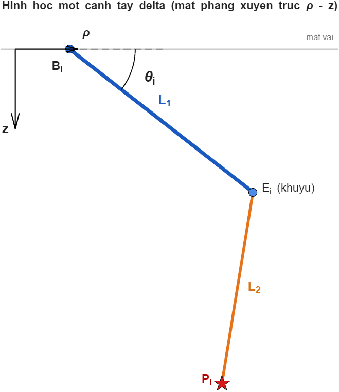
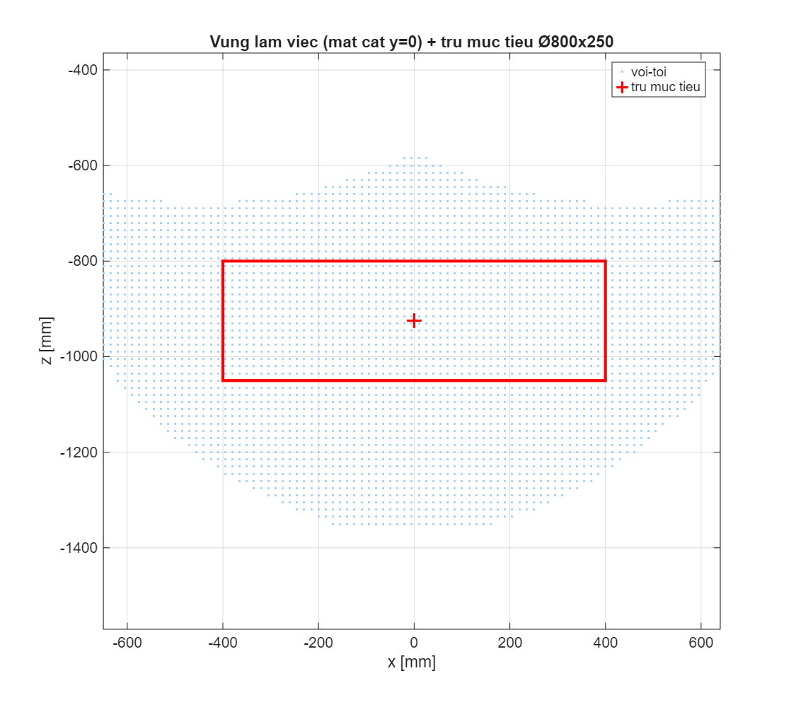

# THUYẾT MINH CHI TIẾT — ĐỘNG HỌC DELTA ROBOT (THUẬN & NGHỊCH)

> Tài liệu trình bày đầy đủ cơ sở lý thuyết và **cách dẫn công thức** động học nghịch (inverse
> kinematics) và động học thuận (forward kinematics) của robot delta 3 bậc tự do tịnh tiến, kèm ví dụ
> tính số và kiểm chứng. Mục tiêu: người đọc hiểu rõ *từ mô hình hình học đến công thức và lời giải*.
>
> **Công cụ:** MATLAB R2025a (`KinematicsSimulation/`: `delta_ik.m`, `delta_fk.m`, `delta_jacobian.m`).
> **Thông số động học:** R = 347 mm, r = 120,6 mm, R−r = 226,4 mm, L1 = 407,5 mm, L2 = 1000 mm,
> phương vị 3 cánh tay φ = [−90°, 30°, 150°].

---

## MỤC LỤC
1. Mô hình hình học và hệ tọa độ
2. Động học nghịch (IK): đặt bài toán và dẫn công thức
3. Lời giải phương trình lượng giác và chọn nghiệm
4. Ví dụ tính số động học nghịch
5. Động học thuận (FK): giao ba mặt cầu
6. Ví dụ tính số động học thuận
7. Kiểm chứng khép kín FK(IK(P))
8. Jacobian và điểm kỳ dị (tóm tắt)
9. Vùng làm việc
10. Kết luận

---

## 1. Mô hình hình học và hệ tọa độ

Robot delta gồm **đế cố định** (mang 3 động cơ) và **bàn máy động** nối với đế qua 3 cánh tay giống
nhau, bố trí cách nhau 120°. Mỗi cánh tay i có:
- **Khớp đế** Bᵢ (trục quay động cơ) nằm trên vòng bán kính R:
$$\mathbf{B}_i = R\,[\cos\varphi_i,\ \sin\varphi_i,\ 0]^\mathsf{T} \quad (1)$$
- **Bắp tay (bicep)** L1 quay quanh Bᵢ một góc θᵢ (đo xuống dưới mặt phẳng ngang), đầu kia là **khuỷu** Eᵢ.
- **Cẳng tay (forearm)** L2 = thanh truyền, nối khuỷu Eᵢ với **khớp bàn máy** Pᵢ bằng khớp cầu hai đầu.
- **Khớp bàn máy** Pᵢ nằm trên bàn máy, cách tâm bàn máy P một đoạn r theo phương φᵢ:
$$\mathbf{P}_i = \mathbf{P} + r\,[\cos\varphi_i,\ \sin\varphi_i,\ 0]^\mathsf{T} \quad (2)$$

Vì cẳng tay là **hình bình hành** (cặp thanh song song), bàn máy **luôn song song với đế** — robot chỉ
tịnh tiến 3 phương (x, y, z), không xoay. Do đó biến khớp là 3 góc θ = (θ₁, θ₂, θ₃) và biến đầu ra là
tâm bàn máy P = (x, y, z).

Vị trí khuỷu theo góc khớp:
$$\mathbf{E}_i = \mathbf{B}_i + L_1\,[\cos\theta_i\cos\varphi_i,\ \cos\theta_i\sin\varphi_i,\ -\sin\theta_i]^\mathsf{T} \quad (3)$$

Ràng buộc chiều dài cẳng tay (bất biến hình học nền tảng của mọi công thức sau):
$$\lVert \mathbf{E}_i - \mathbf{P}_i \rVert = L_2 \qquad (i = 1,2,3) \quad (4)$$

**Hình 1** minh họa một cánh tay trong mặt phẳng xuyên trục (ρ–z), với ρ là phương kính (hướng φᵢ).

---

## 2. Động học nghịch (IK): đặt bài toán và dẫn công thức

**Bài toán:** cho trước vị trí bàn máy P = (x, y, z), tìm 3 góc khớp θᵢ.

Vì 3 cánh tay độc lập, ta giải **từng cánh tay riêng**. Chuyển sang hệ tọa độ gắn với cánh tay i bằng
cách chiếu lên phương kính (cosφᵢ, sinφᵢ) và phương tiếp (−sinφᵢ, cosφᵢ). Đặt hai đại lượng chiếu:
$$u_i = x\cos\varphi_i + y\sin\varphi_i - (R-r) \quad (5)$$
$$w_i = -x\sin\varphi_i + y\cos\varphi_i \quad (6)$$

trong đó uᵢ là **thành phần kính** của véc-tơ nối (đã trừ khoảng cách vòng đế–vòng bàn máy R−r), còn wᵢ
là **thành phần tiếp tuyến** (độ lệch của cẳng tay ra khỏi mặt phẳng cánh tay).

Trong hệ này, khuỷu Eᵢ có tọa độ (kính, tiếp, z) = (R + L1cosθᵢ, 0, −L1sinθᵢ), còn Pᵢ có tọa độ
(a + r, wᵢ, z) với a = x cosφᵢ + y sinφᵢ. Suy ra:
$$\mathbf{E}_i - \mathbf{P}_i = \big(L_1\cos\theta_i - u_i,\ -w_i,\ -L_1\sin\theta_i - z\big) \quad (7)$$

Thay (7) vào ràng buộc (4) và khai triển bình phương:
$$(L_1\cos\theta_i - u_i)^2 + w_i^2 + (L_1\sin\theta_i + z)^2 = L_2^2$$

Khai triển, dùng $\cos^2\theta_i + \sin^2\theta_i = 1$:
$$L_1^2 - 2L_1 u_i\cos\theta_i + 2L_1 z\sin\theta_i + u_i^2 + w_i^2 + z^2 = L_2^2$$

Gom lại thành **phương trình lượng giác chuẩn** một ẩn θᵢ:
$$E_i\sin\theta_i + F_i\cos\theta_i + G_i = 0 \quad (8)$$

với các hệ số:
$$E_i = 2L_1 z,\qquad F_i = -2L_1 u_i,\qquad G_i = L_1^2 + u_i^2 + w_i^2 + z^2 - L_2^2 \quad (9)$$

Đây là dạng $E\sin\theta + F\cos\theta = -G$ — giải được bằng công thức đóng.

---

## 3. Lời giải phương trình lượng giác và chọn nghiệm

Đặt biên độ và pha:
$$\rho_i = \sqrt{E_i^2 + F_i^2},\qquad \psi_i = \operatorname{atan2}(F_i,\ E_i) \quad (10)$$

Khi đó (8) trở thành $\rho_i\sin(\theta_i + \psi_i) = -G_i$, tức:
$$\theta_i = \arcsin\left(\frac{-G_i}{\rho_i}\right) - \psi_i \quad (11)$$

**Điều kiện có nghiệm thực** (điểm P với tới được bằng cánh tay i):
$$\lvert G_i \rvert \le \rho_i \quad (12)$$

Nếu (12) không thỏa → điểm nằm **ngoài vùng làm việc** của cánh tay đó (hàm trả `ok = false`).

Phương trình (8) có **hai nghiệm** ứng với hai cấu hình khuỷu (khuỷu-lên / khuỷu-xuống):
$$\theta_i^{(1,2)} = \left[\arcsin\left(\frac{-G_i}{\rho_i}\right),\ \ \pi - \arcsin\left(\frac{-G_i}{\rho_i}\right)\right] - \psi_i$$

Chọn nghiệm nằm trong **giới hạn góc khớp** [θ_min, θ_max] = [−45°, 100°]; nếu cả hai đều hợp lệ thì
lấy **góc nhỏ hơn** (cấu hình khuỷu hợp lý cho robot treo trần). Đây chính là logic trong `delta_ik.m`.

---

## 4. Ví dụ tính số động học nghịch

Cho P = (150, −100, −900) mm. Xét cánh tay 1 với φ₁ = −90° (cosφ = 0, sinφ = −1):
- Theo (5): $u_1 = 150 \cdot 0 + (-100)(-1) - 226{,}4 = 100 - 226{,}4 = -126{,}4$ mm.
- Theo (6): $w_1 = -150 \cdot (-1) + (-100)\cdot 0 = 150$ mm.
- Theo (9): $E_1 = 2 \cdot 407{,}5 \cdot (-900) = -733500$; $F_1 = -2 \cdot 407{,}5 \cdot (-126{,}4) = 103016$;
  $G_1 = 407{,}5^2 + 126{,}4^2 + 150^2 + 900^2 - 1000^2 \approx -18{,}0 \times 10^{3}$.
- $\rho_1 = \sqrt{E_1^2 + F_1^2} \approx 7{,}41 \times 10^{5}$; kiểm tra $\lvert G_1 \rvert \le \rho_1$ → thỏa (có nghiệm).
- Theo (11): $\theta_1 \approx 9{,}1°$.

Giải đồng thời 3 cánh tay (chạy `delta_ik.m`) cho kết quả:
$$\theta = (9{,}1°,\ 11{,}1°,\ 34{,}4°)$$
Cả 3 nằm trong [−45°, 100°] → điểm với tới được, hợp lệ.

---

## 5. Động học thuận (FK): giao ba mặt cầu

**Bài toán:** cho trước 3 góc khớp θᵢ, tìm vị trí bàn máy P.

Từ (3), 3 vị trí khuỷu Eᵢ hoàn toàn xác định. Ràng buộc (4): $\lVert \mathbf{E}_i - \mathbf{P}_i \rVert = L_2$.
Thay Pᵢ = P + r·[cosφᵢ, sinφᵢ, 0] từ (2), ta chuyển ràng buộc về **tâm bàn máy P** bằng cách "dời" khuỷu
một đoạn r vào trong, tạo **tâm cầu ảo**:
$$\mathbf{C}_i = \mathbf{E}_i - r\,[\cos\varphi_i,\ \sin\varphi_i,\ 0]^\mathsf{T} \quad (13)$$

Khi đó bài toán trở thành: tìm P sao cho:
$$\lVert \mathbf{P} - \mathbf{C}_i \rVert = L_2 \qquad (i = 1,2,3) \quad (14)$$

Tức **P là giao điểm của ba mặt cầu** cùng bán kính L2, tâm C₁, C₂, C₃ (bài toán trilateration).

**Cách giải (khử phi tuyến):** trừ từng cặp phương trình (14) để loại số hạng bậc hai $\lVert \mathbf{P} \rVert^2$:
$$2(\mathbf{C}_2 - \mathbf{C}_1)\cdot\mathbf{P} = \lVert \mathbf{C}_2 \rVert^2 - \lVert \mathbf{C}_1 \rVert^2 \quad (15)$$
$$2(\mathbf{C}_3 - \mathbf{C}_1)\cdot\mathbf{P} = \lVert \mathbf{C}_3 \rVert^2 - \lVert \mathbf{C}_1 \rVert^2 \quad (16)$$

(15)–(16) là **hai phương trình mặt phẳng** → giao nhau cho một **đường thẳng**. Viết dạng tham số:
$$\mathbf{P} = \mathbf{P}_0 + t\,\mathbf{d},\qquad \mathbf{d} = (\mathbf{C}_2 - \mathbf{C}_1)\times(\mathbf{C}_3 - \mathbf{C}_1) \quad (17)$$

với P₀ là nghiệm chuẩn tắc (min-norm) của hệ (15)–(16), d là hướng đường giao (tích có hướng). Thay
(17) vào một mặt cầu $\lVert \mathbf{P} - \mathbf{C}_1 \rVert^2 = L_2^2$ được **phương trình bậc hai theo t**:
$$(\mathbf{d}\cdot\mathbf{d})\,t^2 + 2\,\mathbf{d}\cdot(\mathbf{P}_0 - \mathbf{C}_1)\,t + \lVert \mathbf{P}_0 - \mathbf{C}_1 \rVert^2 - L_2^2 = 0 \quad (18)$$

Giải (18) cho hai nghiệm t (hai giao điểm đối xứng qua mặt phẳng ba tâm). **Chọn nghiệm có z thấp hơn**
(bàn máy nằm phía dưới đế). Nếu biệt thức âm → 3 mặt cầu không giao → bộ góc θ không tạo được cấu hình
hợp lệ. Đây là thuật toán trong `delta_fk.m` (hàm con `trilaterate`).

---

## 6. Ví dụ tính số động học thuận

Cho θ = (19,15°, 19,15°, 19,15°) (tư thế "home"). Tính Eᵢ theo (3), Cᵢ theo (13), giải giao 3 mặt cầu
(18) và chọn z thấp, chạy `delta_fk.m` được:
$$\mathbf{P} = (0,\ 0,\ -925)\ \text{mm}$$

Đúng như thiết kế: tại tư thế đối xứng (3 góc bằng nhau), bàn máy nằm trên trục z, cách mặt vai 925 mm —
đúng tâm vùng làm việc.

---

## 7. Kiểm chứng khép kín FK(IK(P))

Phép kiểm nghiêm ngặt nhất: lấy một tập điểm P, giải nghịch ra θ = IK(P), rồi giải thuận P′ = FK(θ), so
P′ với P. Chạy trên **3000 điểm** trong vùng làm việc:
$$\max \lVert \mathrm{FK}(\mathrm{IK}(\mathbf{P})) - \mathbf{P} \rVert = 6{,}2 \times 10^{-13}\ \text{mm}$$

Sai số cỡ **độ chính xác máy tính** → cả hai công thức thuận/nghịch **nhất quán và chính xác**. Phân bố
sai số ở **Hình 2**.

---

## 8. Jacobian và điểm kỳ dị (tóm tắt)

Đạo hàm ràng buộc (4) theo thời gian: $(\mathbf{E}_i - \mathbf{P}_i)\cdot(\dot{\mathbf{E}}_i - \dot{\mathbf{P}}) = 0$,
gom 3 cánh tay được quan hệ vận tốc:
$$\mathbf{A}\,\dot{\mathbf{P}} = \mathbf{B}\,\dot{\boldsymbol\theta},\qquad \mathbf{J} = \mathbf{A}^{-1}\mathbf{B}\quad (\dot{\mathbf{P}} = \mathbf{J}\,\dot{\boldsymbol\theta}) \quad (19)$$

trong đó hàng i của A là véc-tơ cẳng tay $\mathbf{L}_i = \mathbf{E}_i - \mathbf{P}_i$, còn B chéo với
$B_{ii} = L_1(\mathbf{L}_i \cdot \hat{\mathbf{v}}_i)$. **Điểm kỳ dị:**
- **det A = 0** (Type II — song song): các cẳng tay đồng phẳng, bàn máy mất cứng vững, lực/tốc độ mất
  kiểm soát → **cực nguy hiểm**, phải tránh.
- **det B = 0** (Type I — biên): cánh tay duỗi thẳng hết tầm (biên vùng làm việc).

Chỉ số cảnh báo dùng trong GUI (`delta_gui_simple.m`): **số điều kiện** cond(J) (càng lớn càng gần kỳ dị)
và **góc truyền** μ = góc giữa cẳng tay và bắp tay (càng nhỏ càng gần kỳ dị). Chi tiết `delta_jacobian.m`.

---

## 9. Vùng làm việc

Quét động học nghịch trên lưới không gian, giữ các điểm có nghiệm hợp lệ (12) và trong giới hạn góc, thu
được vùng làm việc. Kết quả: **trụ mục tiêu Ø800 × 250 mm** (tại z = −925) **nằm gọn** trong vùng với tới,
**0 điểm kỳ dị**, số điều kiện Jacobian max 2,75, góc truyền min 49,8° (> 30° an toàn). **Hình 3** (mặt cắt
vùng làm việc) và **Hình 4** (bản đồ số điều kiện).

---

## 10. Kết luận

- **Động học nghịch** giải bằng công thức đóng: chiếu về mặt phẳng cánh tay (5)–(6), đưa ràng buộc chiều
  dài cẳng tay về phương trình lượng giác (8)–(9), giải theo (10)–(11) và chọn nghiệm trong giới hạn góc.
- **Động học thuận** giải bằng giao ba mặt cầu (14): khử bậc hai thành hai mặt phẳng (15)–(16), lấy đường
  giao (17), thế vào một mặt cầu ra bậc hai (18), chọn nghiệm z thấp.
- **Kiểm chứng khép kín** đạt sai số 6,2·10⁻¹³ mm → công thức đúng và cài đặt chính xác.
- Vùng làm việc mục tiêu đạt dư địa lớn, không kỳ dị; các chỉ số Jacobian/góc truyền được dùng làm **khóa
  vùng an toàn** trong giao diện mô phỏng để tránh cấu hình kỳ dị khi điều khiển.

**Tệp liên quan:** `delta_ik.m`, `delta_fk.m`, `delta_jacobian.m`, `delta_gui_simple.m`; hình trong
`figs/`; bản tóm tắt kết quả `KETQUA_DONGHOC.md`.
