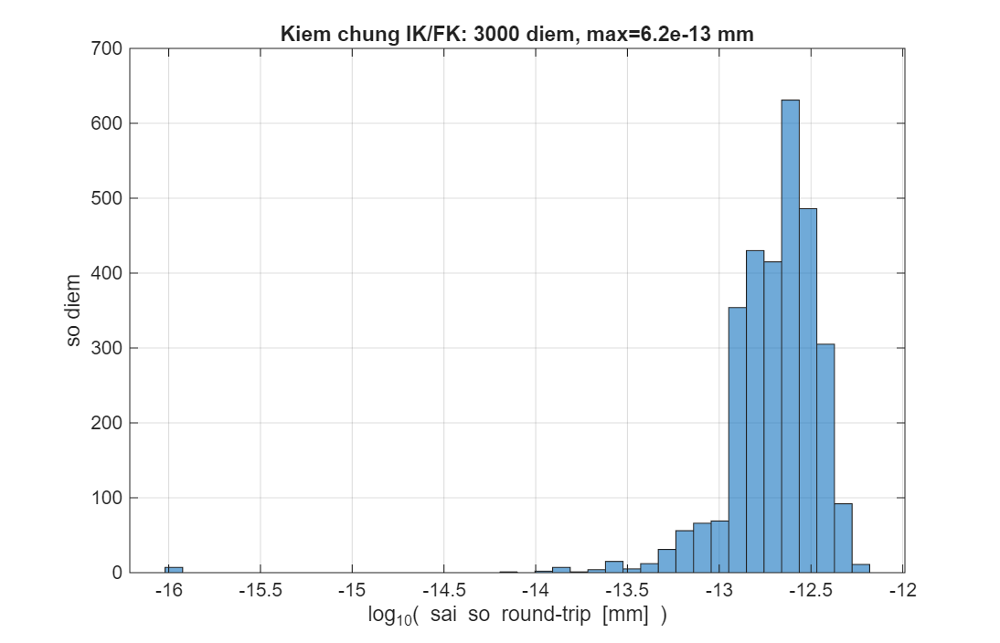
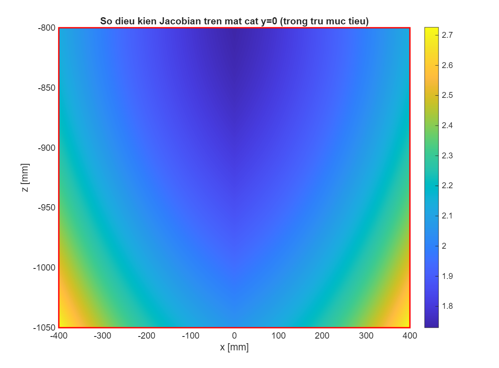
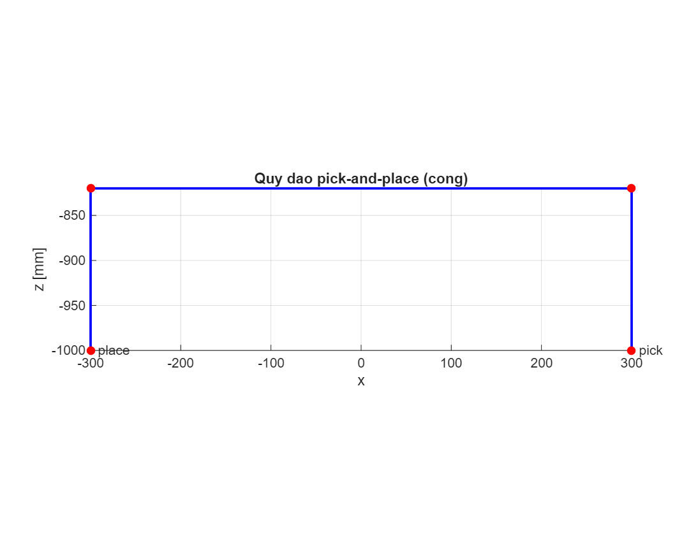
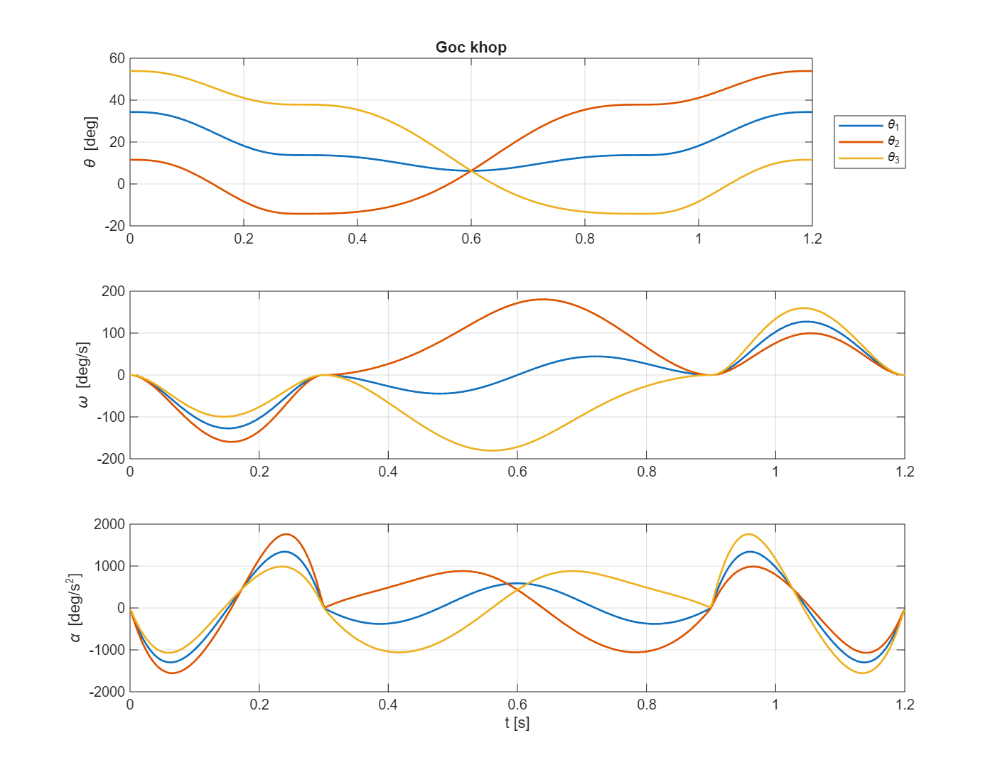
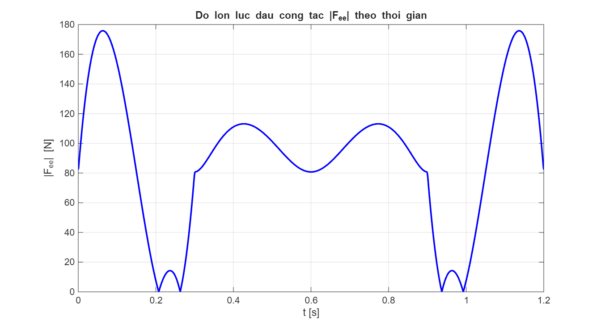
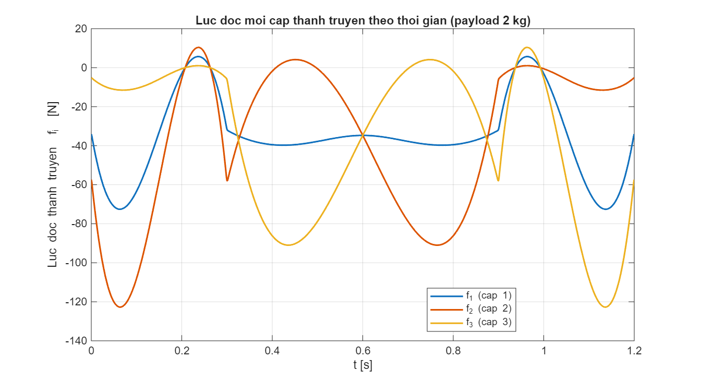
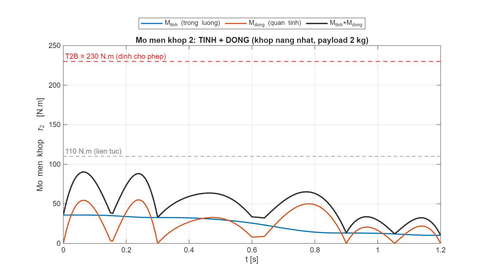

# CHƯƠNG: ĐỘNG HỌC VÀ ĐỘNG LỰC HỌC DELTA ROBOT

> Chương này trình bày hoàn chỉnh phần **động học** (thuận, nghịch, Jacobian, kỳ dị, vùng làm việc,
> giới hạn góc) và **động lực học** (phân tích lực, momen khớp) của robot delta HCMUTE, kèm dẫn công
> thức, tính toán số cụ thể và kết quả mô phỏng. Mọi con số được tính/kiểm chứng bằng MATLAB R2025a
> (`MoPhong_DongHoc/`, `MoPhong_Luc/`).

**Thông số hình học:** R = 347 mm; r = 120,6 mm; R−r = 226,4 mm; L1 = 407,5 mm; L2 = 1000 mm;
phương vị 3 cánh tay φ = [−90°; 30°; 150°]; giới hạn góc khớp θ ∈ [−45°; 100°]; tải trọng payload 2 kg.

---

# A. ĐỘNG HỌC

## 1. Mô hình hình học và hệ tọa độ

Robot delta gồm **đế cố định** mang 3 động cơ và **bàn máy động** nối với đế qua 3 cánh tay giống nhau
cách nhau 120°. Nhờ cấu trúc cẳng tay hình bình hành, bàn máy **luôn song song với đế** — robot có 3 bậc
tự do **tịnh tiến** (x, y, z). Gốc tọa độ tại tâm mặt vai, trục z hướng xuống.

Mỗi cánh tay i: **khớp đế** Bᵢ (trục động cơ), **bắp tay** L1 quay góc θᵢ tới **khuỷu** Eᵢ, **cẳng tay**
L2 (thanh truyền, khớp cầu 2 đầu) nối tới **khớp bàn máy** Pᵢ.

$$\mathbf{B}_i = R\,[\cos\varphi_i,\ \sin\varphi_i,\ 0]^\mathsf{T} \quad (1)$$
$$\mathbf{E}_i = \mathbf{B}_i + L_1\,[\cos\theta_i\cos\varphi_i,\ \cos\theta_i\sin\varphi_i,\ -\sin\theta_i]^\mathsf{T} \quad (2)$$
$$\mathbf{P}_i = \mathbf{P} + r\,[\cos\varphi_i,\ \sin\varphi_i,\ 0]^\mathsf{T} \quad (3)$$
$$\lVert \mathbf{E}_i - \mathbf{P}_i \rVert = L_2 \qquad (i = 1,2,3) \quad (4)$$

| Khớp đế | φᵢ | Bᵢ = (x, y, z) mm |
|---|---|---|
| B₁ | −90° | (0; −347,0; 0) |
| B₂ | 30° | (300,5; 173,5; 0) |
| B₃ | 150° | (−300,5; 173,5; 0) |

## 2. Động học nghịch (P → θ): dẫn công thức

Ba cánh tay độc lập, giải riêng từng cánh tay. Chiếu P lên phương kính và phương tiếp của cánh tay i:
$$u_i = x\cos\varphi_i + y\sin\varphi_i - (R-r),\qquad w_i = -x\sin\varphi_i + y\cos\varphi_i \quad (5)$$

Thay vào ràng buộc (4) và khai triển (dùng cos²+sin²=1) đưa về **phương trình lượng giác chuẩn**:
$$E_i\sin\theta_i + F_i\cos\theta_i + G_i = 0 \quad (6)$$
$$E_i = 2L_1 z,\qquad F_i = -2L_1 u_i,\qquad G_i = L_1^2 + u_i^2 + w_i^2 + z^2 - L_2^2 \quad (7)$$

Giải bằng công thức đóng với ρᵢ = √(Eᵢ²+Fᵢ²), ψᵢ = atan2(Fᵢ,Eᵢ):
$$\theta_i = \arcsin\left(\frac{-G_i}{\rho_i}\right) - \psi_i,\qquad \text{điều kiện với tới: } \lvert G_i\rvert \le \rho_i \quad (8)$$

Phương trình (6) có hai nghiệm (hai cấu hình khuỷu); chọn nghiệm trong [−45°; 100°], lấy góc nhỏ hơn
(cấu hình phù hợp robot treo trần). Thuật toán trong `delta_ik.m`.

## 3. Tính toán động học nghịch chi tiết

**Đề bài:** P = (150; −100; −900) mm. Áp dụng (5)–(8) cho từng cánh tay:

| Đại lượng | Cánh tay 1 (φ=−90°) | Cánh tay 2 (φ=30°) | Cánh tay 3 (φ=150°) |
|---|---|---|---|
| a = x·cosφ + y·sinφ | 100,0 | 79,9 | −179,9 |
| **uᵢ** = a − (R−r) | −126,4 | −146,5 | −406,3 |
| **wᵢ** | 150,0 | −161,6 | 11,6 |
| Eᵢ = 2·L1·z | −733 500 | −733 500 | −733 500 |
| Fᵢ = −2·L1·uᵢ | 103 016 | 119 394 | 331 138 |
| Gᵢ | 14 533 | 23 633 | 141 274 |
| ρᵢ | 740 699 | 743 154 | 804 782 |
| ψᵢ | 172,01° | 170,75° | 155,70° |
| **θᵢ** | **9,12°** | **11,07°** | **34,41°** |

**Kết quả:** θ = (9,12°; 11,07°; 34,41°), cả 3 trong giới hạn → điểm với tới được.

## 4. Động học thuận (θ → P): giao ba mặt cầu

Từ (2), 3 khuỷu Eᵢ xác định. Chuyển ràng buộc (4) về tâm bàn máy P qua **tâm cầu ảo**:
$$\mathbf{C}_i = \mathbf{E}_i - r\,[\cos\varphi_i,\ \sin\varphi_i,\ 0]^\mathsf{T} \quad (9)$$

P là **giao 3 mặt cầu** bán kính L2 tâm Cᵢ. Trừ cặp phương trình để tuyến tính hóa (khử |P|²), được 2
mặt phẳng → giao là đường thẳng **P = P₀ + t·d**, d = (C₂−C₁)×(C₃−C₁); thế vào một mặt cầu ra **phương
trình bậc hai theo t**, chọn nghiệm **z thấp hơn** (bàn máy dưới đế). Thuật toán trong `delta_fk.m`.

## 5. Tính toán động học thuận chi tiết

**Đề bài:** θ = (30°; 20°; 40°).

| Cánh tay | Bᵢ (mm) | Eᵢ (mm) | Cᵢ (mm) |
|---|---|---|---|
| 1 | (0; −347,0; 0) | (0; −699,9; −203,7) | (0; −579,3; −203,7) |
| 2 | (300,5; 173,5; 0) | (632,1; 365,0; −139,4) | (527,7; 304,7; −139,4) |
| 3 | (−300,5; 173,5; 0) | (−570,9; 329,6; −261,9) | (−466,4; 269,3; −261,9) |

Giao 3 mặt cầu: P₀ = (15,9; −2,0; 2,0); d = (−424 255; 2 713; 3 440 329); bậc hai a·t²+b·t+c=0 với
a = 1,202×10¹³, b = 1,405×10⁹, c = −6,241×10⁵, Δ = 3,197×10¹⁹ > 0. Hai nghiệm:
Pₐ = (−59,1; −1,5; +610,3) và P_b = (140,6; −2,8; −1008,6). Chọn z thấp:
$$\boxed{\ \mathbf{P} = (140{,}6;\ -2{,}8;\ -1008{,}6)\ \text{mm}\ }$$

## 6. Kiểm chứng khép kín FK(IK(P))

Lấy 3000 điểm P trong vùng làm việc, tính θ = IK(P) rồi P′ = FK(θ), so với P:
$$\max \lVert \mathrm{FK}(\mathrm{IK}(\mathbf{P})) - \mathbf{P}\rVert = 6{,}2\times10^{-13}\ \text{mm}$$
Sai số cỡ độ chính xác máy → công thức thuận/nghịch **nhất quán, chính xác** (Hình 2).

## 7. Giới hạn góc quay và vùng tọa độ với tới

Giới hạn cơ cấu θ ∈ [−45°; 100°]. Ánh xạ giới hạn góc → vị trí bàn máy trên trục (đặt 3 góc bằng nhau):

| θ₀ | z bàn máy (mm) | Ghi chú |
|---|---|---|
| −45° | −569,3 | cao nhất |
| 0° | −773,4 | bicep nằm ngang |
| **19,15°** | **−925,0** | HOME (tâm vùng làm việc) |
| 50° | −1184,8 | |
| 100° | −1389,1 | thấp nhất |

→ Trên trục, giới hạn góc cho khoảng z ∈ [−569,3; −1389,1] mm. Bán kính với tới theo phương ngang tại
z = −925 là ≥ 650 mm (yêu cầu 400). **Trụ làm việc Ø800 × 250 mm nằm gọn** trong vùng với tới.

| Tư thế | θ = (θ₁,θ₂,θ₃) | P (mm) |
|---|---|---|
| HOME | (19,15°×3) | (0; 0; −925,0) |
| Ví dụ IK | (9,12°; 11,07°; 34,41°) | (150; −100; −900) |
| Ví dụ FK | (30°; 20°; 40°) | (140,6; −2,8; −1008,6) |
| Cao nhất | (−45°×3) | (0; 0; −569,3) |
| Thấp nhất | (100°×3) | (0; 0; −1389,1) |

---

# B. JACOBIAN, ĐIỂM KỲ DỊ, VÙNG LÀM VIỆC

## 8. Jacobian vận tốc

Đạo hàm (4) theo thời gian: $(\mathbf{E}_i-\mathbf{P}_i)\cdot(\dot{\mathbf{E}}_i - \dot{\mathbf{P}}) = 0$,
gom 3 cánh tay:
$$\mathbf{A}\,\dot{\mathbf{P}} = \mathbf{B}\,\dot{\boldsymbol\theta},\qquad \mathbf{J}_f = \mathbf{A}^{-1}\mathbf{B}\quad(\dot{\mathbf{P}} = \mathbf{J}_f\,\dot{\boldsymbol\theta}) \quad (10)$$
hàng i của A là véc-tơ cẳng tay Lᵢ = Eᵢ − Pᵢ; B chéo, Bᵢᵢ = L1(Lᵢ·v̂ᵢ).

## 9. Điểm kỳ dị và chỉ số an toàn

- **det A = 0** (Type II — song song): cẳng tay đồng phẳng, bàn máy mất cứng vững → **cực nguy hiểm**.
- **det B = 0** (Type I — biên): cánh tay duỗi hết tầm (biên vùng làm việc).

Chỉ số cảnh báo (dùng trong giao diện `delta_gui_simple.m`): **số điều kiện** cond(Jf) và **góc truyền**
μ (góc cẳng tay–bắp tay). Kết quả quét vùng làm việc: **0 điểm kỳ dị**, cond max **2,75** (tb 2,13), góc
truyền min **49,8°** (> 30° an toàn) — Hình 3, Hình 4.

---

# C. QUỸ ĐẠO VÀ ĐỘNG LỰC HỌC

## 10. Quỹ đạo pick-and-place và thông số động lực đỉnh

Quỹ đạo gắp–thả dùng nội suy **quintic** (đạo hàm bậc 5, vận tốc/gia tốc trơn tại hai đầu), chu kỳ
**1,2 s**, hành trình pick(300, 0, −1000) → place(−300, 0, −1000). Kết quả 100% với tới; thông số đỉnh:

| Đại lượng đỉnh | Giá trị |
|---|---|
| Tốc độ TCP | 1875 mm/s (≈ 1,18 g) |
| Tốc độ khớp | 30 rpm (180 °/s) |
| Gia tốc khớp | 1761 °/s² |

## 11. Động lực học: phân tích lực và momen khớp

**Mô hình:** cẳng tay là **thanh 2 lực** (khớp cầu 2 đầu) → chỉ chịu **lực dọc trục** theo véc-tơ đơn vị
$\hat{\mathbf{l}}_i$. Cân bằng lực tại bàn máy (định luật II Newton, khối lượng quy về đầu công tác
m_ee = bàn máy + payload + ½ hệ thanh truyền = **8,233 kg**):
$$\sum_{i=1}^{3} f_i\,\hat{\mathbf{l}}_i = m_{ee}\,(\mathbf{a} - \mathbf{g}),\qquad \mathbf{g}=[0;0;-9{,}81]\ \text{m/s}^2 \quad (11)$$
với fᵢ là lực dọc mỗi **cặp** cẳng tay. Giải hệ (11) (3 phương trình, 3 ẩn fᵢ) tại mỗi điểm quỹ đạo.

**Momen khớp động cơ** suy từ nguyên lý công ảo, dùng **chuyển vị Jacobian**:
$$\boldsymbol\tau = \mathbf{J}_f^\mathsf{T}\,\mathbf{F}_{ee} \quad (12)$$
với $\mathbf{F}_{ee} = m_{ee}(\mathbf{a}-\mathbf{g})$ là lực tổng ở đầu công tác.

**Kết quả đỉnh (payload 2 kg, chạy `force_analysis.m` trên toàn quỹ đạo):**

| Đại lượng | Giá trị đỉnh |
|---|---|
| Lực đầu công tác \|F_ee\| | **175,8 N** |
| Lực dọc mỗi cặp cẳng tay \|fᵢ\| | **122,7 N** (mỗi thanh 61,3 N) |
| Momen khớp thành phần bàn máy \|τᵢ\| = \|J_v^⊤F_ee\| | **48,37 N·m** |
| Momen uốn bicep (≈ f·L1) | **50,0 N·m** |

**Bảng tải dùng cho mô phỏng bền (FEA):**

| Chi tiết | Tải áp dụng |
|---|---|
| DR-006 Elbow-Clevis | 123 N (1 cặp cẳng tay, chia 2 lỗ rod) |
| 6516K305 Rod (carbon) | 62 N dọc trục (kiểm oằn Euler) |
| DR-007 Moving-Platform | 62 N mỗi điểm bắt (×6) |
| DR-005-2 Upper-Arm-Link | momen uốn ~50 N·m tại vai |

**Kiểm động cơ – hộp số:** momen khớp thành phần bàn máy 48,37 N·m **chưa đủ** để chọn động cơ — phải
cộng thêm trọng lượng + quán tính **bắp tay 6,9 kg** và quán tính **rotor quy về trục ra**
$J_{rot}=J_{mot}i^2$, tách **tĩnh + động**, nhân **hệ số an toàn** $k_s=1{,}5$ (chi tiết trong thuyết
minh chọn động cơ `MoPhong_Luc/ThuyetMinh_ChonDongCo.md`). Kết quả: $M_{yc}=k_s(M_{tĩnh}+M_{động})
= 1{,}5(35{,}8+55{,}0) = 136{,}3$ N·m; hộp số ban đầu TPM-010S-061T (T2B 80 N·m) **không đủ**
($112{,}5>80$ với $J_{rot}$ của nó) → **đã chọn và thay vào CAD hộp số TPMA010S-055T** (TPM+ HIGH
TORQUE, T2B 230 N·m, stall 110 N·m): đạt cả ba điều kiện — đỉnh dư 1,69×, liên tục dư 2,06×, tốc độ
30,1 ≤ 88 vòng/phút.

---

## 12. Kết luận chương

- **Động học nghịch** giải bằng công thức đóng (5)–(8); **động học thuận** giải bằng giao ba mặt cầu
  (9); kiểm chứng khép kín sai số 6,2·10⁻¹³ mm → chính xác và nhất quán.
- **Giới hạn góc** [−45°; 100°] cho vùng với tới bao trọn trụ làm việc **Ø800 × 250 mm**, dư địa lớn,
  **không điểm kỳ dị** (cond ≤ 2,75; góc truyền ≥ 49,8°).
- **Động lực học** (payload 2 kg): lực đầu công tác đỉnh 175,8 N — **tải thực cho mô phỏng bền**
  (các khâu đều dư bền lớn, FEA: FOS ≥ 30); momen yêu cầu chọn động cơ $M_{yc}=136{,}3$ N·m
  (tĩnh + động kể cả bắp tay và rotor, ×1,5) → **hộp số TPMA010S-055T** (T2B 230 N·m, dư 1,69×,
  đã thay vào mô hình CAD).

**Tệp nguồn:** `delta_ik.m`, `delta_fk.m`, `delta_jacobian.m`, `force_analysis.m`, `delta_gui_simple.m`;
hình trong `MoPhong_DongHoc/figs/` và `MoPhong_Luc/figs/`.
