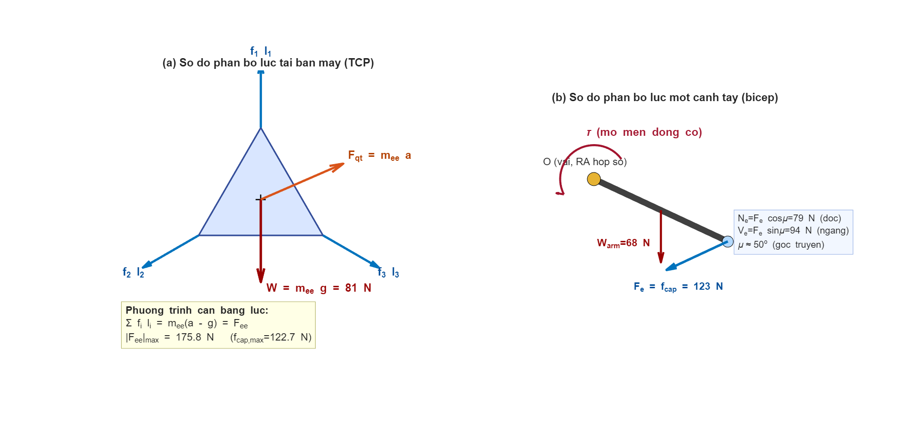
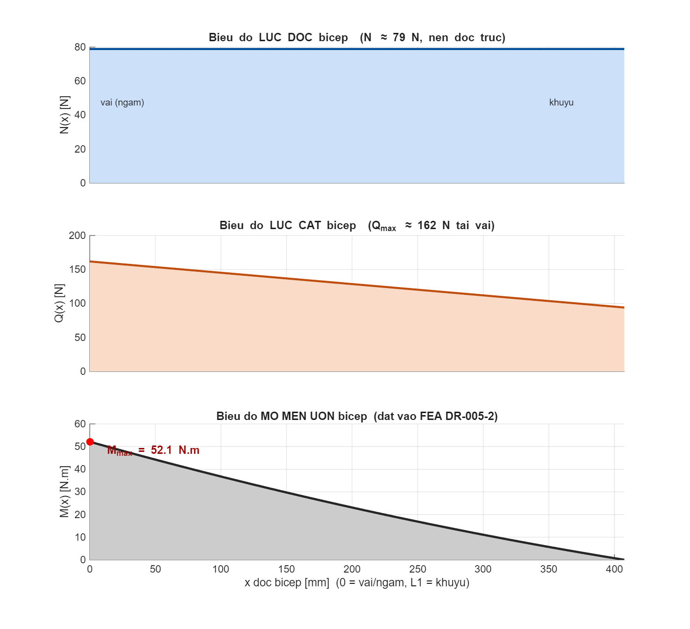
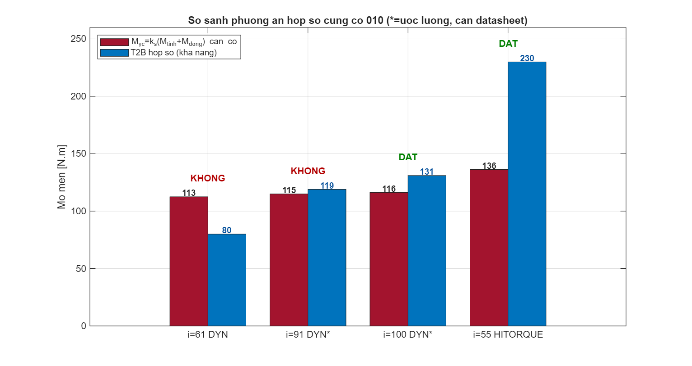

% THUYẾT MINH TÍNH TOÁN LỰC & CHỌN ĐỘNG CƠ – HỘP SỐ
% Robot Delta song song 3 bậc tự do — payload 2 kg
% HCMUTE — Đồ án tốt nghiệp

## 1. Mục tiêu và dữ liệu đầu vào

Phần này xác định **tải trọng thực** đặt lên các khâu (làm đầu vào mô phỏng bền FEA) và
**kiểm tra – lựa chọn động cơ–hộp số** theo phương pháp mô men **tĩnh cộng động, nhân hệ số an
toàn**. Các kết quả số được trích trực tiếp từ `MoPhong_Luc/out/force_log.txt` (MATLAB).

**Thông số động học** (nguồn `params.m`): $L_1 = 407{,}5$ mm (bắp tay), $L_2 = 1000$ mm (cẳng
tay, tâm–tâm khớp cầu), $R-r = 226{,}4$ mm, $r = 120{,}6$ mm. Quỹ đạo khảo sát: chu trình
gắp–đặt (pick-and-place) dạng đa thức bậc 5, chu kỳ $T = 1{,}2$ s.

**Khối lượng** (đọc từ mô hình SolidWorks):

| Ký hiệu | Chi tiết | Giá trị |
|---|---|---:|
| $m_{plat}$ | Bàn máy DR-007 | 4,214 kg |
| $m_{pay}$ | Tải công tác (payload) | 2,0 kg |
| $m_{rod}$ | 1 thanh truyền 6516K305 (carbon) | 0,348 kg |
| $m_{ball}$ | 1 khớp cầu 60645K471 (thép) | 0,325 kg |
| $m_{arm}$ | **1 bắp tay DR-005 (hub + link, nhôm)** | **6,912 kg** |

Khối lượng quy về đầu công tác (TCP), gồm bàn máy, payload và một nửa hệ thanh truyền về phía
bàn máy:
$$ m_{ee} = m_{plat} + m_{pay} + \tfrac{1}{2}\,(6\,m_{rod} + 6\,m_{ball}) = 8{,}233 \ \text{kg} \quad (1) $$

## 2. Mô hình lực và sơ đồ phân bố lực

Mỗi cẳng tay được nối hai đầu bằng khớp cầu nên là **thanh chịu hai lực** (two-force member):
chỉ chịu lực **dọc trục** theo vector đơn vị $\mathbf{l}_i$ (khuỷu → bàn máy). Xét cân bằng
động (nguyên lý d'Alembert) tại bàn máy, tổng các lực dọc ba cặp cẳng tay cân bằng với lực quán
tính và trọng lượng quy về TCP (Hình 1a):

$$ \sum_{i=1}^{3} f_i\,\mathbf{l}_i \;=\; m_{ee}\,(\mathbf{a} - \mathbf{g}) \;=\; \mathbf{F}_{ee}
\qquad \mathbf{g}=[0;0;-9{,}81]\ \text{m/s}^2 \quad (2) $$

trong đó $f_i$ là lực dọc mỗi **cặp** cẳng tay (2 thanh), $\mathbf{a}$ là gia tốc TCP. Giải hệ
(2) cho $f_i = \mathbf{L}^{-1}\mathbf{F}_{ee}$ với $\mathbf{L}=[\mathbf{l}_1\,\mathbf{l}_2\,\mathbf{l}_3]$.

**Kết quả đỉnh** trên quỹ đạo (payload 2 kg):

$$ |\mathbf{F}_{ee}|_{max} = 175{,}8\ \text{N}, \qquad
|f_i|_{max} = 122{,}7\ \text{N}\ \ (\text{tức } 61{,}4\ \text{N/thanh}) \quad (3) $$

## 3. Nội lực trong bắp tay và cẳng tay

Bắp tay được xét như **dầm công-xôn** ngàm tại trục vai ($x=0$), chịu tại đầu khuỷu ($x=L_1$)
lực cẳng tay $F_e = f_{cap}$ phân tích theo góc truyền $\mu \approx 50^\circ$ thành thành phần
dọc $N_e = F_e\cos\mu$ và ngang $V_e = F_e\sin\mu$, cộng thêm trọng lượng bản thân phân bố. Nội
lực dọc trục $N(x)$, lực cắt $Q(x)$ và mô men uốn $M(x)$ (Hình 2) đạt giá trị lớn nhất tại vai:

$$ M_{max} \approx f_{cap}\,L_1 = 122{,}7 \times 0{,}4075 = 52{,}1\ \text{N·m} \quad (4) $$

Giá trị này là tải uốn đặt vào mô phỏng bền chi tiết DR-005-2. Cẳng tay là thanh hai lực nên
lực dọc không đổi dọc chiều dài, $N_{rod} = 61{,}4$ N (nén/kéo — đã kiểm oằn Euler trong FEA).

## 4. Mô men tại trục khớp — tĩnh và động

Mô men khớp gồm hai thành phần. **Mô men tĩnh** (giữ trọng lượng ở gia tốc bằng 0):

$$ M_{t,i} \;=\; \underbrace{\big[\mathbf{J}_v^{\!\top}(-m_{ee}\,\mathbf{g})\big]_i}_{\text{giữ TCP}}
\;+\; \underbrace{m_{arm}\,g\,\tfrac{L_1}{2}\cos\theta_i}_{\text{trọng lượng bắp tay}} \quad (5) $$

**Mô men động** (quán tính), gồm phần quy về TCP qua Jacobian vận tốc $\mathbf{J}_v$ và phần quán
tính riêng của bắp tay cùng rotor–hộp số:

$$ M_{d,i} \;=\; \big[\mathbf{J}_v^{\!\top}(m_{ee}\,\mathbf{a})\big]_i
\;+\; (J_{arm}+J_{rot})\,\ddot\theta_i \quad (6) $$

với $J_{arm} = \tfrac{1}{3}m_{arm}L_1^2 = 0{,}383$ kg·m² (mô hình thanh mảnh đều — giả thiết thiên
về an toàn vì hub nặng nằm gần trục làm quán tính thực nhỏ hơn) và $J_{rot} = J_{mot}\,i^2$ là
quán tính rotor+hộp số quy về trục ra. **Lưu ý:** $M_{động}$ phụ thuộc hộp số đang xét qua
$J_{rot}$ — mỗi phương án hộp số phải tính lại thành phần này.

Gia tốc góc khớp đỉnh $\ddot\theta_{max} = 1762^\circ/\text{s}^2 = 30{,}8$ rad/s²; tốc độ góc
khớp đỉnh $\omega_{max} = 30{,}1$ vòng/phút. Thành phần mô men đỉnh trên cả chu kỳ (3 khớp),
tính cho hai hộp số:

| Thành phần | TPM-010S-061T ($i=61$, $J_{rot}=0{,}071$) | TPMA010S-055T ($i=55$, $J_{rot}=0{,}660$) |
|---|---:|---:|
| $M_{tĩnh}$ = giữ TCP (22,3) + bắp tay (13,8) | **35,8 N·m** | **35,8 N·m** |
| $M_{động}$ = quán tính TCP (30,8) + bắp tay+rotor | 13,9 → **39,2 N·m** | 32,0 → **55,0 N·m** |
| $M_{tổng} = M_{tĩnh} + M_{động}$ | **75,0 N·m** | **90,9 N·m** |

## 5. Điều kiện chọn động cơ – hộp số

Áp **hệ số an toàn** $k_s = 1{,}5$ cho tổng mô men tĩnh và động (trường hợp bất lợi hai đỉnh
trùng nhau):

$$ M_{yc} = k_s\,(M_{tĩnh} + M_{động}) \quad (7) $$

Với hộp số ban đầu TPM-010S-061T: $M_{yc} = 1{,}5 \times 75{,}0 = 112{,}5$ N·m.

Bộ truyền được chọn phải thỏa đồng thời ba điều kiện: mô men đỉnh, mô men liên tục và tốc độ:

$$ M_{yc} \le T_{2B}, \qquad M_{rms} \le T_{stall}, \qquad \omega_{max} \le n_{2,max} \quad (8) $$

**Kiểm hộp số ban đầu TPM-010S-061T** (dòng TPM+ DYNAMIC, $i=61$; catalog: $T_{2B}=80$ N·m,
$T_{stall}=29$ N·m, $n_{2,max}=98$ vòng/phút):

| Điều kiện | Yêu cầu | Rating | Kết quả |
|---|---:|---:|:--|
| Đỉnh: $M_{yc} \le T_{2B}$ | 112,5 | 80 | ❌ **KHÔNG ĐẠT** |
| Liên tục: $M_{rms} \le T_{stall}$ | ~45 | 29 | ❌ **KHÔNG ĐẠT** |
| Tốc độ: $\omega \le n_{2,max}$ | 30,1 | 98 | ✅ đạt |

**Nhận xét:** ngay cả bỏ hệ số an toàn, $M_{tổng}=75 \approx 80$ nên biên còn rất mỏng. Nguyên
nhân là bắp tay nhôm nặng 6,9 kg (đóng góp 13,8 N·m tĩnh và 13,9 N·m động) kết hợp gia tốc cao
~1,18 g. **TPM-010S-061T không đủ khả năng.**

## 6. So sánh phương án và lựa chọn

Tăng tỉ số truyền $i$ làm tăng mô men ra $T_{2B}$ nhưng đồng thời tăng quán tính rotor quy đổi
$J_{rot}=J_{mot}\,i^2$ (làm tăng $M_{động}$) và giảm tốc độ ra. Khảo sát các phương án cùng cỡ
010 (Hình 4; $i=61$ và $i=55$ là số liệu **thật** từ catalog, $i=91/100$ là **ước lượng tuyến
tính** cần xác nhận datasheet):

| Phương án | $i$ | $M_{động}$ | $M_{yc}$ | $T_{2B}$ | $M_{rms}$ | $T_{stall}$ | Kết luận |
|---|--:|--:|--:|--:|--:|--:|:--|
| TPM 010S-061T DYNAMIC (cũ) | 61 | 39,2 | 112,5 | 80 | 45,4 | 29 | ❌ không đạt |
| TPM 010S $i=91$ DYNAMIC* | 91 | 40,8 | 115,0 | 119 | 46,5 | 43 | ❌ thiếu liên tục |
| TPM 010S $i=100$ DYNAMIC* | 100 | 41,7 | 116,3 | 131 | 47,0 | 48 | ⚠ sát (ước lượng) |
| **TPMA 010S-055T HIGH TORQUE (đã chọn)** | 55 | 55,0 | **136,3** | **230** | 53,4 | 110 | ✅ **đạt, dư 1,69×** |

**Lựa chọn: hộp số–động cơ tích hợp TPMA 010S-055T** (dòng TPM+ HIGH TORQUE, cùng cỡ 010). Đây
là phương án có số liệu thật, **kiểm chính thức đạt cả ba điều kiện** (chạy lại
`force_analysis.m` với $J_{rot}=0{,}660$ kg·m², log `out/force_log.txt`):

| Điều kiện | Yêu cầu | Rating TPMA | Kết quả |
|---|---:|---:|:--|
| Đỉnh: $M_{yc} \le T_{2B}$ | 136,3 | 230 | ✅ **đạt, dư 1,69×** |
| Liên tục: $M_{rms} \le T_{stall}$ | 53,4 | 110 | ✅ **đạt, dư 2,06×** |
| Tốc độ: $\omega \le n_{2,max}$ | 30,1 | 88 | ✅ đạt |

Thông số TPMA 010S-055T: $T_{2B}=230$ N·m, $T_{stall}=110$ N·m, mô men hãm 248 N·m,
$n_{2,max}=88$ vòng/phút, lực dọc trục cho phép 2150 N, mô men lật 400 N·m, $J_{mot}=2{,}18$
kg·cm², khối lượng 8,1 kg.

Đường tăng tỉ số truyền thuần trong dòng DYNAMIC chỉ đủ ở khoảng $i=100$ và **sát ngưỡng mô men
liên tục** (do rotor nặng thêm), lại phụ thuộc tỉ số truyền có sẵn trong catalog nên kém chắc
chắn hơn.

## 7. Kết luận và ghi chú tích hợp

- Phân tích lực đã bổ sung đầy đủ theo yêu cầu trình bày: **sơ đồ phân bố lực** (Hình 1), **biểu
  đồ nội lực N/Q/M** (Hình 2), ký hiệu và công thức chuẩn hóa.
- Mô men động cơ được tính **tách tĩnh và động, có kể trọng lượng và quán tính bắp tay**, nhân
  **hệ số an toàn** $k_s=1{,}5$; $M_{động}$ tính lại theo từng hộp số qua $J_{rot}=J_{mot}i^2$.
- **TPM-010S-061T (T2B 80 N·m) không đủ** ($M_{yc}=112{,}5>80$) → chọn **TPMA 010S-055T
  (T2B 230 N·m)** cùng cỡ 010; kiểm chính thức: $M_{yc}=136{,}3 \le 230$ (dư 1,69×),
  $M_{rms}=53{,}4 \le 110$ (dư 2,06×), $30{,}1 \le 88$ vòng/phút — **đạt cả ba điều kiện**.
- **Tích hợp cơ khí — ĐÃ THAY vào mô hình CAD (2026-07-15):** đo trực tiếp hai mô hình CAD cho
  thấy giao diện lắp từ mặt bích ra về phía trước của TPMA **giống hệt** TPM cũ (bích Ø117,5×7,
  ngõng định tâm Ø90×9,6, pilot Ø63, mặt ra cách bích 30,0 mm) → **không phải sửa gá nào**
  (DR-002/003/004 giữ nguyên). Phần dài thêm 63,3 mm dồn hết về đuôi động cơ (vùng trống). Sau
  thay: vị trí mặt bích ra trùng khớp tuyệt đối (sai lệch 0,000 mm cả 3 tay) → thông số động học
  $R-r$ không đổi; kiểm giao thoa 504 = 504 vị trí (không phát sinh); khối lượng robot theo
  catalog tăng thêm 3×(8,1−4,9) = 9,6 kg về phía đế. Bằng chứng: `outputs/gearbox_swap_20260714/`.
- **FEA bền/độ võng không phải chạy lại**: bảng tải FEA sau khi thay hộp số **y nguyên**
  ($F_{ee}$ 175,8 N; thanh truyền 61,4 N; uốn bắp tay ~51 N·m) vì tải các khâu đến từ động lực
  học bàn máy (khối lượng chuyển động không đổi); phần $M_{động}$ tăng thêm dùng để gia tốc
  chính rotor bên trong hộp số, không truyền qua bích ra.

*Độ bảo thủ:* $J_{arm}$ dùng mô hình thanh mảnh đều (quán tính thực nhỏ hơn); $M_{tổng}$ cộng hai
đỉnh tĩnh–động (không luôn xảy ra đồng thời). Số thực thấp hơn đôi chút nhưng không đổi kết luận
vì biên vượt/đạt đều đủ lớn.
