# Delta Robot Design — 3-DOF Parallel Robot Mechanical Design

> **Mechanical design project** — Ho Chi Minh City University of Technology and Education (HCMUTE).
> Complete mechanical design of a ceiling-mounted 3-DOF Delta parallel robot for high-speed pick-and-place, benchmarked against the ABB IRB 360 FlexPicker.

This repository contains the SolidWorks CAD model, the MATLAB analysis and simulation code, the finite-element (FEA) results, and the machining drawings. Every conclusion is backed by data read back from the model or the solver — no assumed figures. All figures below are taken from the design analysis and FEA results.

---

## Overview

| | |
|---|---|
| Architecture | 3-DOF Delta (parallel), rotational actuators, ceiling-mounted |
| Payload | **2 kg** |
| Workspace | cylinder **Ø800 × 250 mm**, centred ≈ 925 mm below the shoulder plane |
| Pick-and-place cycle | 1.2 s (quintic trajectory) |
| Peak TCP speed / acceleration | ≈ 1875 mm/s / ≈ 1.18 g |
| Actuator | Wittenstein TPMA010S-055T gearmotor, ratio *i* = 55 |
| Structural material | Aluminium 6061-T6 (all machined parts) |
| Total mass | 122.4 kg (CAD model), ≈ 140 kg estimated real |
| Minimum factor of safety (whole robot, full workspace) | **7.1** |

---

## 1. Kinematic architecture

| Symbol | Meaning | Value |
|---|---|---|
| L₁ | upper-arm (bicep) length: shoulder axis → elbow ball line | 407.5 mm |
| L₂ | forearm length, ball-centre to ball-centre | 1000.0 mm |
| R − r | base radius − moving-platform radius | 226.4 mm |
| r | moving-platform radius | 120.6 mm |

  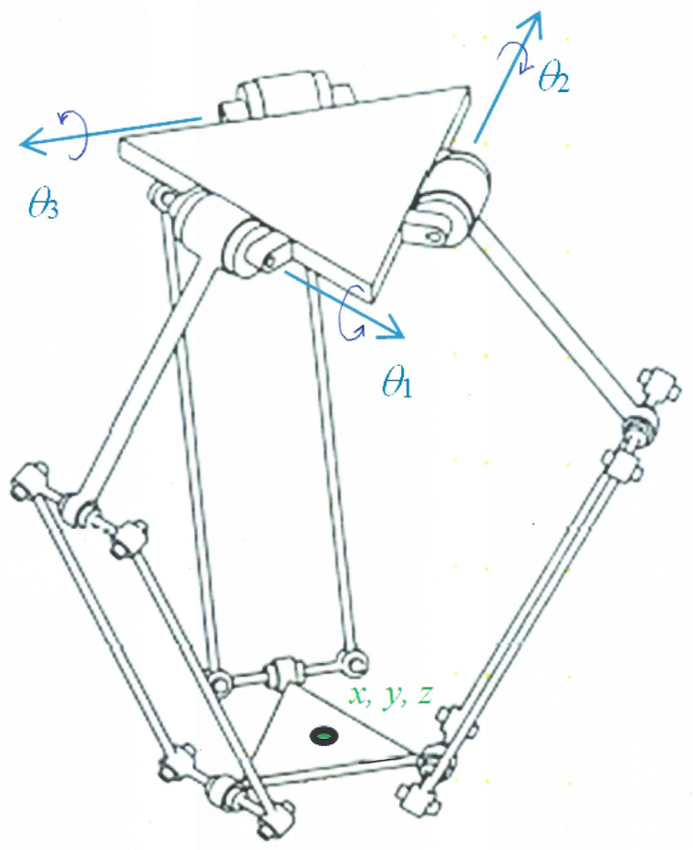
  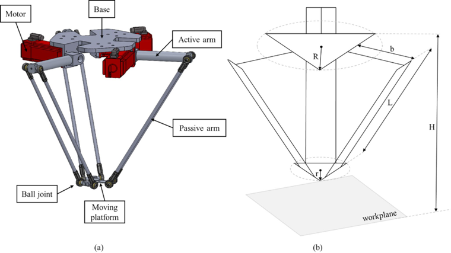

<b>Fig. 2.1 / 2.3.</b> Basic structure of the three-arm RUU Delta robot (left); CAD model and the general geometric parameters R, r, L, b, H (right).

## 2. Kinematics verification

The inverse and forward kinematics were implemented independently and cross-checked:

- Round-trip error ‖P − FK(IK(P))‖ ≤ **6.2 × 10⁻¹³ mm** over 3000 sample points.
- Reachable radius 650 mm at z = −925 mm (requirement: 400 mm).
- Jacobian: **no singular points** inside the workspace; condition number κ(J) max 2.75, average 2.13; minimum forearm–bicep transmission angle 49.8°.

  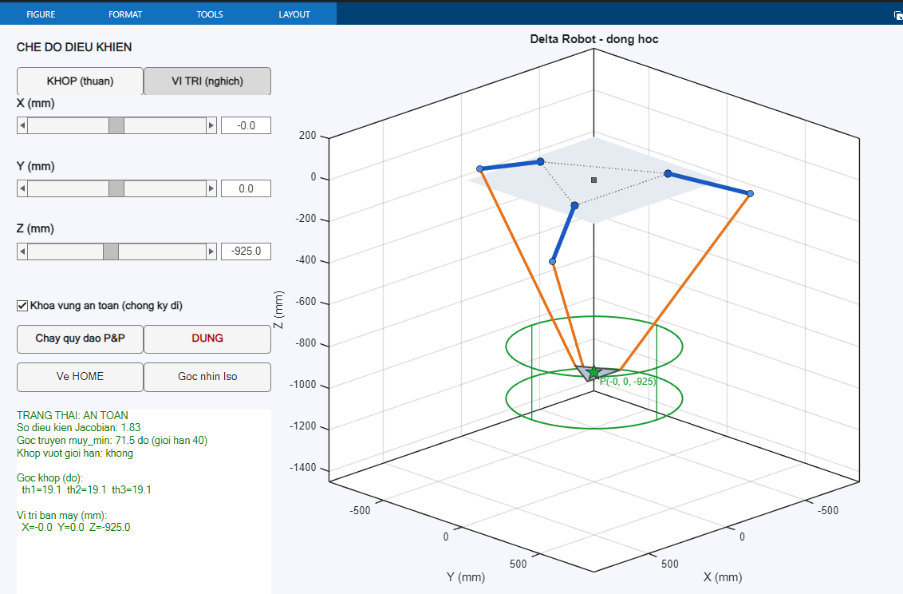
  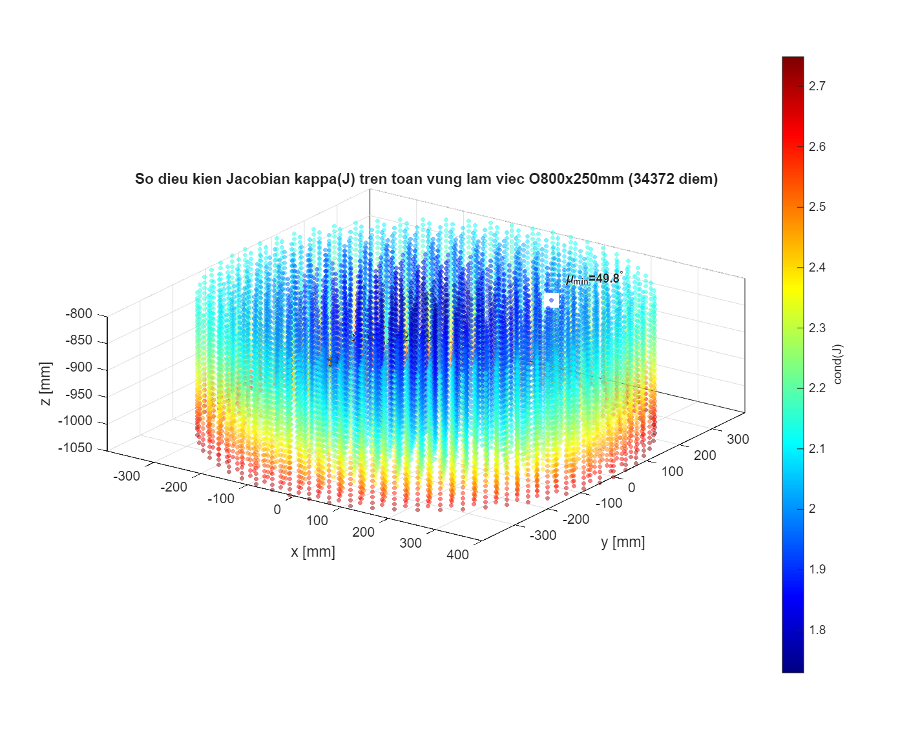

<b>Fig. 2.8 / 3.6.</b> Simulation check of the kinematic computation (left); distribution of the Jacobian condition number and the force-transmission angle over the working region (right).

  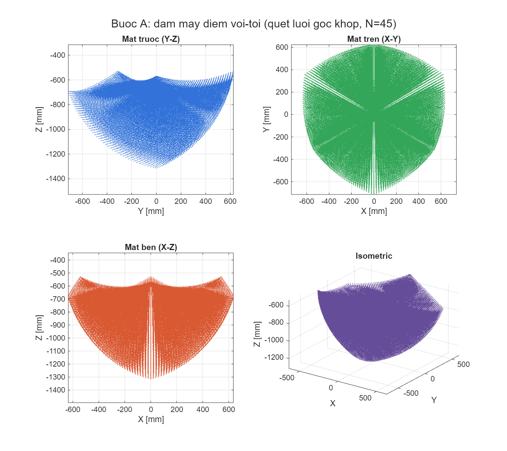
  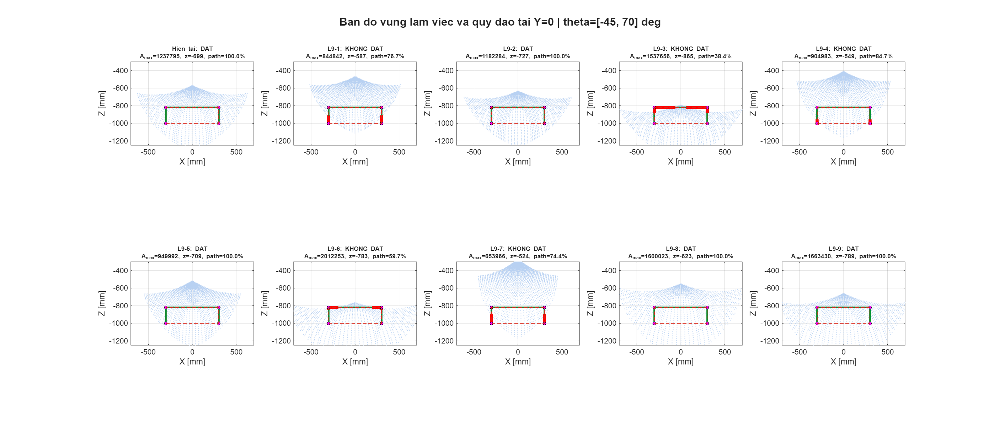

<b>Fig. 3.4 / 3.2.</b> Workspace point cloud from the three joint-angle sweep (left); workspace map at y = 0 with the pick-and-place trajectory check (right).

## 3. Motion & trajectory

The pick-and-place cycle is planned as a fifth-order (quintic) polynomial and the joint kinematics are checked against their bounds.

  
  

<b>Fig. 3.8 / 3.9.</b> Pick-and-place trajectory interpolated with a fifth-order polynomial (left); joint angle, angular-velocity and angular-acceleration bounds along the trajectory (right). Peak joint speed 30.1 rpm.

## 4. Force & dynamic analysis

Forearm links are solved as two-force members; joint torques are obtained through the Jacobian. Loads are swept over the whole workspace (centre + 24 edge points + 4 waypoints × 26 peak-acceleration directions) and the worst case is retained.

| Quantity | Nominal (centre pose) | Worst case (workspace edge, R400 / z−1050) |
|---|---|---|
| End-effector force F_ee | 175.8 N | 176.1 N |
| Forearm-pair force | 122.7 N (61.3 N per rod) | **182.4 N** (× 1.49) |
| Bicep bending moment | ≈ 50 N·m | **74.3 N·m** (× 1.49) |
| Platform joint torque τ | 48.4 N·m | — |
| Jacobian condition number | — | 2.75 (no singularity) |

  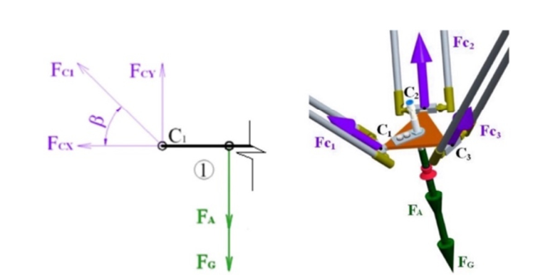
  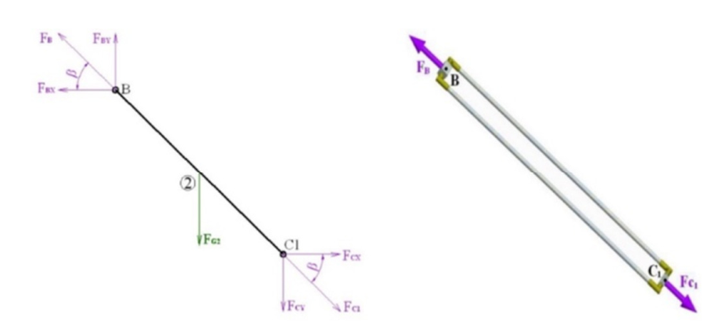

<b>Fig. 4.2 / 4.3.</b> Force diagram at the moving platform (left) and in the passive (long) arm (right).

  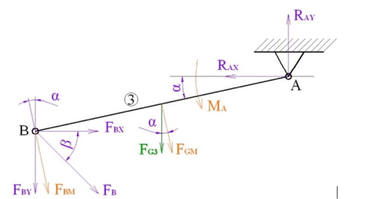
  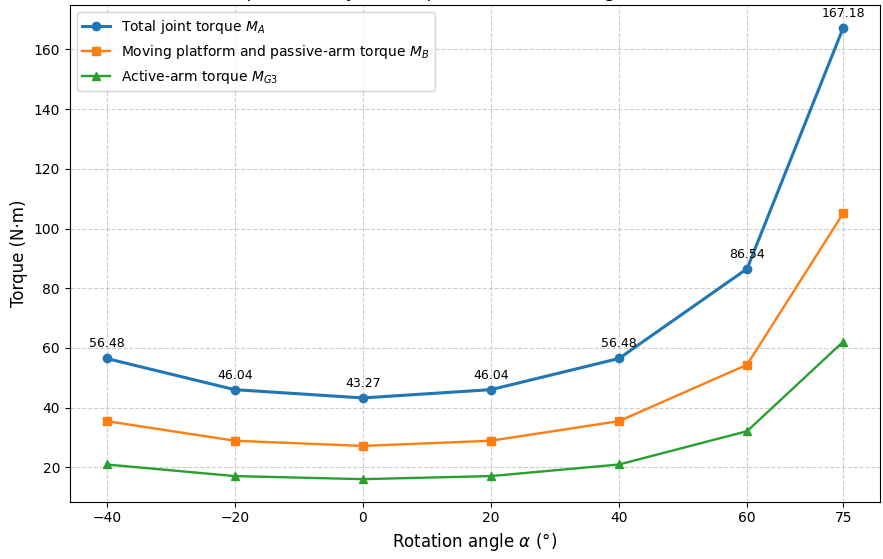

<b>Fig. 4.4 / 4.5.</b> Force diagram of the active arm (left); torque at the active joint versus tilt angle α (right).

## 5. Actuator selection

The required joint torque is split into static and dynamic terms and multiplied by a 1.5 safety factor (per the advisor's method), including the bicep weight and inertia (6.9 kg, from CAD) and the reflected rotor inertia *J*₍mot₎·*i*²:

| Criterion | Result | Margin |
|---|---|---|
| Required torque M_yc = (M_static 35.8 + M_dynamic 55.0) × 1.5 | 136.3 N·m ≤ T2B 230 N·m | **1.69 ×** |
| RMS torque M_rms | 53.4 N·m ≤ 110 N·m | **2.06 ×** |
| Joint speed | 30.1 rpm ≤ 88 rpm | pass |

The initially considered TPM-010S-061T (T2B 80 N·m) is rejected — M_yc 112.5 N·m > 80 N·m. The high-torque **TPMA010S-055T** passes all three criteria.

  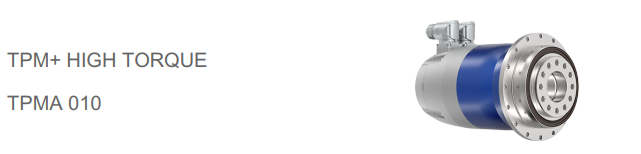

<b>Fig. 4.6.</b> Selected gearmotor with reduction unit — Wittenstein TPMA010S-055T.

## 6. Structure & materials

- **All machined parts: aluminium 6061-T6.** The base was first designed in ASTM A36 steel but was too heavy, so all three base blocks were reassigned to 6061-T6 (−128.8 kg).
- Forearm connecting rods: carbon fibre. Ball-joint rod ends (`60645K471`): alloy steel.
- The base plate (`DR-001`) is split into three separate fabrication blocks — mounting plate, welded frame, and hanging lid — bolted/welded together.
- Part numbering: `DR-000` main assembly, `DR-001…DR-007` machined parts; purchased parts keep their vendor names.

  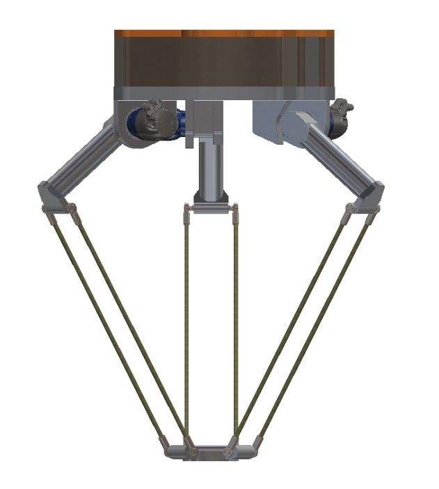

<b>Fig. 4.1.</b> 3D design model in SolidWorks.

## 7. Structural validation (FEA)

SolidWorks Simulation, static studies on the load-bearing parts with the peak dynamic loads from §4, including a mesh-convergence sweep and a full-workspace multi-pose sweep.

| Part | von Mises (worst pose) | Factor of safety |
|---|---|---|
| DR-006 Elbow clevis | 38.8 MPa | **7.1** (governing) |
| DR-005-2 Upper-arm link | — | 43.5 |
| DR-007 Moving platform | — | 14.7 |
| DR-001-1 Base plate (aluminium) | — | ≈ 1268 |
| DR-001-3 Ceiling lid (aluminium) | — | ≈ 72 |

  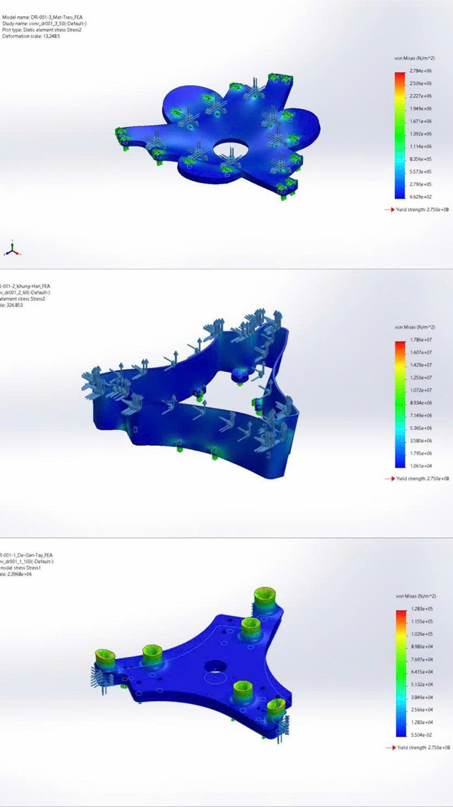
  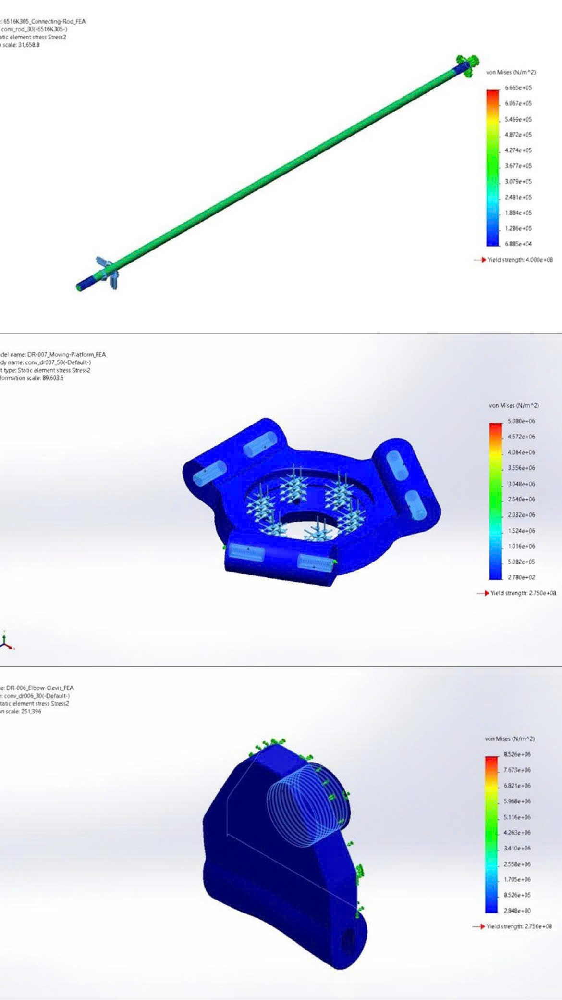

<b>Fig. 4.7 / 4.8.</b> von Mises stress — DR-001-3, DR-001-2 and DR-001-1 (left); DR-006, DR-007 and connecting rod 6516K305 (right). The whole-robot minimum factor of safety over the entire workspace is <b>7.1</b>.

---

## 8. Design report — chapters

| Chapter | Title | What it covers |
|---|---|---|
| **1** | Overview | Motivation; state of the art of Delta robots; general and specific objectives; research object and scope; research method; report outline. |
| **2** | Theoretical basis | Delta structure and working principle; geometric model and coordinate frames; kinematic foundations — degrees of freedom, geometric parameters, per-limb closed-loop equations, forward kinematics, inverse kinematics, model-consistency check; basis for the vacuum-gripper design — joint layout and suction-cup arrangement, suction force and vacuum pressure. |
| **3** | Workspace computation & simulation | Objectives, scope and input data; the L9 survey parameter set and the test trajectory; point-density workspace simulation — joint-space sweep, volume and largest-cross-section estimate; verification of the target Ø800 × 250 mm cylinder, of the pick-and-place trajectory, and of the joint velocity / acceleration bounds. |
| **4** | Load analysis, material & drivetrain selection | Material selection; part masses from CAD; load data and force-distribution model; internal-force analysis of the links — free-body model, axial forces, motor–gearbox selection; FEA strength check of the main load-bearing parts; overall strength summary versus requirements. |
| **5** | Electrical & control system design | Machine-vision system — colour/shape recognition algorithm and test results on sample images; camera–robot–conveyor coordinate transforms; control-board architecture. |
| **6** | Conclusion & future work | Results, limitations of the work, and development directions. |

---

The full design report, third-party vendor CAD and reference papers are not included in this repository (see `.gitignore`). All rights reserved; please cite if reused. © JohnNguyen205, HCMUTE.
