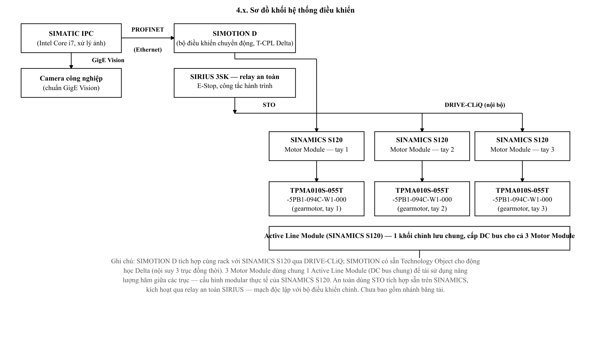
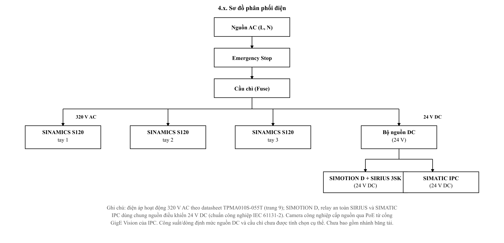
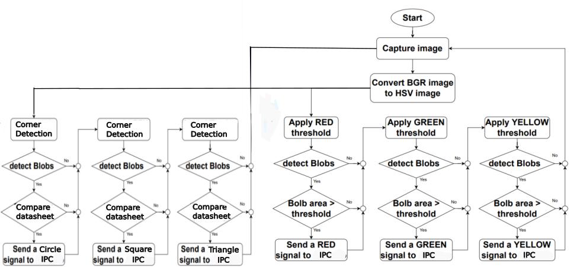
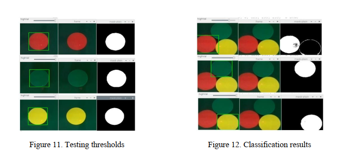

# Delta Robot Design — 3-DOF Parallel Robot Mechanical Design

> **Mechanical design project** — Ho Chi Minh City University of Technology and Education (HCMUTE).
> Complete mechanical design of a ceiling-mounted 3-DOF Delta parallel robot for high-speed pick-and-place, benchmarked against the ABB IRB 360 FlexPicker.

This repository contains the SolidWorks CAD model, the MATLAB analysis and simulation code, the finite-element (FEA) results, the machining drawings, and the electrical / control-system and machine-vision design. Every conclusion is backed by data read back from the model or the solver — no assumed figures. All figures below are taken from the design analysis, the FEA results and the control-system design.

---

## Overview

| | |
|---|---|
| Architecture | 3-DOF Delta (parallel), rotational actuators, ceiling-mounted |
| Payload | **2 kg** |
| Workspace | cylinder **Ø800 × 250 mm**, centred ≈ 925 mm below the shoulder plane |
| Pick-and-place cycle | 1.2 s (quintic trajectory) |
| Peak TCP speed / acceleration | ≈ 1875 mm/s / ≈ 1.18 g |
| Actuator | Wittenstein TPMA010S-055T gearmotor, ratio *i* = 55 |
| Structural material | Aluminium 6061-T6 (all machined parts) |
| Total mass | 122.4 kg (CAD model), ≈ 140 kg estimated real |
| Minimum factor of safety (whole robot, full workspace) | **7.1** |

---

## 1. Kinematic architecture

| Symbol | Meaning | Value |
|---|---|---|
| L₁ | upper-arm (bicep) length: shoulder axis → elbow ball line | 407.5 mm |
| L₂ | forearm length, ball-centre to ball-centre | 1000.0 mm |
| R | base joint-circle radius | 347.0 mm |
| r | moving-platform radius | 120.6 mm |
| R − r | base radius − moving-platform radius | 226.4 mm |
| φᵢ | arm azimuths | −90°, 30°, 150° |
| θᵢ | motor-angle range (elbow-down) | −45° … 70° |

  
  

<b>Fig. 2.1 / 2.3.</b> Basic structure of the three-arm RUU Delta robot (left); CAD model and the general geometric parameters R, r, L, b, H (right).

### Geometric model

For arm $i$ with azimuth $\phi_i$ ($\phi=(-90^\circ,\,30^\circ,\,150^\circ)$), write $c_i=\cos\phi_i$, $s_i=\sin\phi_i$; the motor angle $\theta_i$ is measured downward from the shoulder plane. The base joint, platform joint and elbow of each arm are

$$\mathbf{B}_i = R\,(c_i,\; s_i,\; 0)$$

$$\mathbf{P}_i = \mathbf{P} + r\,(c_i,\; s_i,\; 0)$$

$$\mathbf{E}_i = \mathbf{B}_i + L_1\,(\cos\theta_i\,c_i,\;\; \cos\theta_i\,s_i,\;\; -\sin\theta_i)$$

and the rigid forearm imposes one closure equation per arm:

$$\lVert\, \mathbf{E}_i - \mathbf{P}_i \,\rVert = L_2 .$$

### Inverse kinematics (closed form)

For a target $\mathbf{P}=(x,y,z)$, expanding the closure equation reduces each arm to a single equation in $\theta_i$:

$$E_i\sin\theta_i + F_i\cos\theta_i + G_i = 0$$

$$u_i = (x\,c_i + y\,s_i) - (R-r), \qquad w_i = -x\,s_i + y\,c_i$$

$$E_i = 2L_1 z, \qquad F_i = -2L_1 u_i, \qquad G_i = L_1^{2} + u_i^{2} + w_i^{2} + z^{2} - L_2^{2}$$

With $\rho_i=\sqrt{E_i^{2}+F_i^{2}}$ and $\psi_i=\operatorname{atan2}(F_i,E_i)$ the solution is

$$\theta_i = \arcsin\!\left(\frac{-G_i}{\rho_i}\right) - \psi_i \qquad (\theta_i \in [-45^\circ,\,70^\circ],\ \text{elbow-down root}).$$

A real solution exists only if $|G_i| \le \rho_i$; otherwise $\mathbf{P}$ is outside the reachable workspace.

### Forward kinematics

Given $\boldsymbol\theta$, shift each elbow to a virtual centre $\mathbf{C}_i = \mathbf{E}_i - r\,(c_i,\,s_i,\,0)$. The platform centre $\mathbf{P}$ is the trilateration of three spheres of radius $L_2$ about $\mathbf{C}_1,\mathbf{C}_2,\mathbf{C}_3$, taking the lower-$z$ intersection. Round-trip check: $\lVert \mathbf{P} - \mathrm{FK}(\mathrm{IK}(\mathbf{P})) \rVert \le 6.2\times10^{-13}$ mm over 3000 points (§2).

### Velocity Jacobian & singularity

Differentiating the three closure equations gives

$$\mathbf{A}\,\dot{\mathbf{P}} = \mathbf{B}\,\dot{\boldsymbol\theta}, \qquad \dot{\mathbf{P}} = \mathbf{J}\,\dot{\boldsymbol\theta}, \qquad \mathbf{J} = \mathbf{A}^{-1}\mathbf{B}$$

where row $i$ of $\mathbf{A}$ is the forearm direction $(\mathbf{E}_i-\mathbf{P}_i)^{\top}$, and $\mathbf{B}=\operatorname{diag}(b_i)$ with $b_i = L_1\,(\mathbf{E}_i-\mathbf{P}_i)^{\top}\hat{\mathbf{v}}_i$, $\ \hat{\mathbf{v}}_i = (-\sin\theta_i\,c_i,\; -\sin\theta_i\,s_i,\; -\cos\theta_i)$. Then $\det\mathbf{A}=0$ is a parallel (Type II) singularity, $\det\mathbf{B}=0$ a boundary (Type I) singularity, and $\kappa(\mathbf{J})$ measures proximity to one. Over the target workspace $\kappa(\mathbf{J})_{\max}=2.75$ with no singular points.

## 2. Kinematics verification

The inverse and forward kinematics were implemented independently and cross-checked:

- Round-trip error ‖P − FK(IK(P))‖ ≤ **6.2 × 10⁻¹³ mm** over 3000 sample points.
- Reachable radius 650 mm at z = −925 mm (requirement: 400 mm).
- Jacobian: **no singular points** inside the workspace; condition number κ(J) max 2.75, average 2.13; minimum forearm–bicep transmission angle 49.8°.

  
  

<b>Fig. 2.8 / 3.6.</b> Simulation check of the kinematic computation (left); distribution of the Jacobian condition number and the force-transmission angle over the working region (right).

  
  

<b>Fig. 3.4 / 3.2.</b> Workspace point cloud from the three joint-angle sweep (left); workspace map at y = 0 with the pick-and-place trajectory check (right).

## 3. Motion & trajectory

The pick-and-place cycle is planned as a fifth-order (quintic) polynomial and the joint kinematics are checked against their bounds.

  
  

<b>Fig. 3.8 / 3.9.</b> Pick-and-place trajectory interpolated with a fifth-order polynomial (left); joint angle, angular-velocity and angular-acceleration bounds along the trajectory (right). Peak joint speed 30.1 rpm.

## 4. Force & dynamic analysis

Forearm links are solved as two-force members; joint torques are obtained through the Jacobian. Loads are swept over the whole workspace (centre + 24 edge points + 4 waypoints × 26 peak-acceleration directions) and the worst case is retained.

| Quantity | Nominal (centre pose) | Worst case (workspace edge, R400 / z−1050) |
|---|---|---|
| End-effector force F_ee | 175.8 N | 176.1 N |
| Forearm-pair force | 122.7 N (61.3 N per rod) | **182.4 N** (× 1.49) |
| Bicep bending moment | ≈ 50 N·m | **74.3 N·m** (× 1.49) |
| Platform joint torque τ | 48.4 N·m | — |
| Jacobian condition number | — | 2.75 (no singularity) |

  
  

<b>Fig. 4.2 / 4.3.</b> Force diagram at the moving platform (left) and in the passive (long) arm (right).

  
  

<b>Fig. 4.4 / 4.5.</b> Force diagram of the active arm (left); torque at the active joint versus tilt angle α (right).

## 5. Actuator selection

The required joint torque is split into static and dynamic terms and multiplied by a 1.5 safety factor (per the advisor's method), including the bicep weight and inertia (6.9 kg, from CAD) and the reflected rotor inertia *J*₍mot₎·*i*²:

| Criterion | Result | Margin |
|---|---|---|
| Required torque M_yc = (M_static 35.8 + M_dynamic 55.0) × 1.5 | 136.3 N·m ≤ T2B 230 N·m | **1.69 ×** |
| RMS torque M_rms | 53.4 N·m ≤ 110 N·m | **2.06 ×** |
| Joint speed | 30.1 rpm ≤ 88 rpm | pass |

The initially considered TPM-010S-061T (T2B 80 N·m) is rejected — M_yc 112.5 N·m > 80 N·m. The high-torque **TPMA010S-055T** passes all three criteria.

  

<b>Fig. 4.6.</b> Selected gearmotor with reduction unit — Wittenstein TPMA010S-055T.

## 6. Structure & materials

- **All machined parts: aluminium 6061-T6.** The base was first designed in ASTM A36 steel but was too heavy, so all three base blocks were reassigned to 6061-T6 (−128.8 kg).
- Forearm connecting rods: carbon fibre. Ball-joint rod ends (`60645K471`): alloy steel.
- The base plate (`DR-001`) is split into three separate fabrication blocks — mounting plate, welded frame, and hanging lid — bolted/welded together.
- Part numbering: `DR-000` main assembly, `DR-001…DR-007` machined parts; purchased parts keep their vendor names.

  

<b>Fig. 4.1.</b> 3D design model in SolidWorks.

## 7. Structural validation (FEA)

SolidWorks Simulation, static studies on the load-bearing parts with the peak dynamic loads from §4, including a mesh-convergence sweep and a full-workspace multi-pose sweep.

| Part | von Mises (worst pose) | Factor of safety |
|---|---|---|
| DR-006 Elbow clevis | 38.8 MPa | **7.1** (governing) |
| DR-005-2 Upper-arm link | — | 43.5 |
| DR-007 Moving platform | — | 14.7 |
| DR-001-1 Base plate (aluminium) | — | ≈ 1268 |
| DR-001-3 Ceiling lid (aluminium) | — | ≈ 72 |

  
  

<b>Fig. 4.7 / 4.8.</b> von Mises stress — DR-001-3, DR-001-2 and DR-001-1 (left); DR-006, DR-007 and connecting rod 6516K305 (right). The whole-robot minimum factor of safety over the entire workspace is <b>7.1</b>.

---

## 8. Electrical & control system

The control system is a Siemens motion-control stack. An industrial PC (**SIMATIC IPC**) runs the vision pipeline and streams pick coordinates over **PROFINET** to a **SIMOTION D** motion controller, which carries a built-in Delta technology object (synchronous three-axis interpolation). SIMOTION drives three **SINAMICS S120** motor modules over **DRIVE-CLiQ**, one per arm, each powering a **TPMA010S-055T** gearmotor with incremental-encoder feedback. The three motor modules share one Active Line Module (common DC bus), so braking energy is recovered between axes.

Safety is a hardwired chain independent of the main controller: an E-Stop / limit-switch loop (Siemens 3RG40 / SIRIUS 3SK) triggers **STO** (Safe Torque Off, IEC 61800-5-2) directly on the SINAMICS drives through a SIRIUS 3SK safety relay.

Servo power is **320 V AC** (per the TPMA010S-055T datasheet); SIMOTION, the SIRIUS relay and the IPC share a **24 V DC** control supply (IEC 61131-2); the camera is powered over its GigE link. DC-supply and fuse ratings, and the conveyor branch, are not yet dimensioned.

| Link | Bus / standard | Purpose |
|---|---|---|
| Camera (Basler acA1300-30gc) ↔ SIMATIC IPC | GigE Vision (Ethernet ≤ 1000 Mbps) | raw high-speed image transfer |
| SIMATIC IPC ↔ SIMOTION D | PROFINET IO (real-time industrial Ethernet) | pick coordinates / status |
| SIMOTION D ↔ SINAMICS S120 (×3) | DRIVE-CLiQ (internal bus, same rack) | servo control, real-time encoder feedback |
| SIRIUS 3SK ↔ SINAMICS S120 | STO (IEC 61800-5-2, hardwired) | controller-independent safe torque off |
| E-Stop / limit switch (3RG40) ↔ SIRIUS 3SK | hardwired digital I/O | safety signal |
| SINAMICS S120 ↔ TPMA010S-055T (×3) | power cable + incremental-encoder cable | servo power, position feedback |
| AC mains ↔ SINAMICS S120 | 320 V AC | drive power |
| DC supply ↔ IPC / SIMOTION / SIRIUS | 24 V DC | control power |

  

<b>Fig. 5.6.</b> Control-system block diagram — vision IPC, SIMOTION D motion controller, three SINAMICS S120 drives on a shared DC bus, and the SIRIUS / STO safety branch.

  

<b>Fig. 5.7.</b> Power distribution — AC mains through E-Stop and fuse to 320 V AC for the three drives and a 24 V DC control supply for the IPC, SIMOTION D and SIRIUS relay.

## 9. Machine vision (image processing)

Each frame is converted from BGR to HSV, then two branches run in parallel. The **shape** branch performs corner / blob detection and template matching, classifying every object as circle, square or triangle. The **colour** branch applies fixed HSV thresholds for red, green and yellow and detects blobs by area. The two results are merged into a `(colour, shape)` label per object, and the corresponding pick coordinate is sent to the IPC.

| Colour | Lower (H, S, V) | Upper (H, S, V) |
|---|---|---|
| Red | (173, 0, 0) | (255, 255, 255) |
| Yellow | (18, 0, 76) | (36, 255, 255) |
| Green | (58, 155, 114) | (85, 255, 255) |

On a synthetic test image of 9 objects (3 shapes × 3 colours) on a dark, conveyor-like background, the algorithm returned the correct `(colour, shape)` label for **all 9**, and the red threshold isolated a clean binary mask containing only the 3 red objects — confirming the pipeline before integration with a real camera.

A pixel coordinate (u, v) is mapped to a physical pick point (X, Y) through three coordinate frames — camera {C}, robot base {B} and conveyor {W} — by a linear calibration.

  

<b>Fig. 5.1.</b> Colour- and shape-recognition algorithm: parallel shape branch (corner / blob detection, template match → circle / square / triangle) and colour branch (HSV threshold → red / green / yellow, blob by area).

  

<b>Fig. 5.5.</b> Threshold tuning per colour (left) and the resulting multi-object classification on the simulated conveyor image (right).

---

## 10. Design report — chapters

| Chapter | Title | What it covers |
|---|---|---|
| **1** | Overview | Motivation; state of the art of Delta robots; general and specific objectives; research object and scope; research method; report outline. |
| **2** | Theoretical basis | Delta structure and working principle; geometric model and coordinate frames; kinematic foundations — degrees of freedom, geometric parameters, per-limb closed-loop equations, forward kinematics, inverse kinematics, model-consistency check; basis for the vacuum-gripper design — joint layout and suction-cup arrangement, suction force and vacuum pressure. |
| **3** | Workspace computation & simulation | Objectives, scope and input data; the L9 survey parameter set and the test trajectory; point-density workspace simulation — joint-space sweep, volume and largest-cross-section estimate; verification of the target Ø800 × 250 mm cylinder, of the pick-and-place trajectory, and of the joint velocity / acceleration bounds. |
| **4** | Load analysis, material & drivetrain selection | Material selection; part masses from CAD; load data and force-distribution model; internal-force analysis of the links — free-body model, axial forces, motor–gearbox selection; FEA strength check of the main load-bearing parts; overall strength summary versus requirements. |
| **5** | Electrical & control system design | Machine-vision system — colour/shape recognition algorithm and test results on sample images; camera–robot–conveyor coordinate transforms; control-board architecture. |
| **6** | Conclusion & future work | Results, limitations of the work, and development directions. |

---

The full design report, third-party vendor CAD and reference papers are not included in this repository (see `.gitignore`). All rights reserved; please cite if reused. © JohnNguyen205, HCMUTE.
